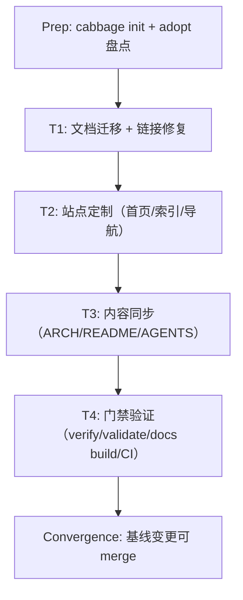

<!-- Replace every marked prompt before verifying this stage. Split work into vertical tracer-bullet tasks with an explicit DAG dependency graph and complete every checkbox. -->

# Preparation

## Parallel Execution Strategy

- **Sequential Baseline**: cabbage init、adopt 盘点修正（已完成）。
- **Parallel Slices**: 站点定制（T2，文档已迁移后独立）与内容同步（T3，标题/组件描述独立于站点）可在 T1 后并行；本仓库单执行者，实际顺序执行。
- **Convergence & Verification**: T4 统一跑 validate / docs build / 检查 cabbage.yml。

- [x] `cabbage init` + `cabbage adopt` 执行，adoption-report.md 剔除 401 项误扫（third_party/aur/src），记录保留/排除决策

# Tasks

## Task 1: 文档迁移与链接修复
- **Builds**: 10 份文档全部位于标准编号树，站内链接与反引号路径引用全部可解析。
- **Blocked By**: None (or Preparation)
- **Parallel Group**: Group 1
- **Verification**: `rg` 扫描无失效 `docs/(architecture|adr|dev|prd|reviews)` 引用；`git status` 确认 rename
- [x] `git mv` 迁移 10 份文档（03-architecture / 01-product / 06-development / 11-ci-cd），清理空目录
- [x] 修复 v4 文档、ADR-0001、specs/tasks 中的失效链接与路径引用
- [x] 验证无残留旧路径引用（rg 全量扫描）

## Task 2: 站点定制
- **Builds**: docs 站点为项目自有首页 + 5 个有内容分区的索引页 + 定制导航/侧栏。
- **Blocked By**: Task 1
- **Parallel Group**: Group 2
- **Verification**: `cabbage docs build` 成功生成站点
- [x] docs/README.md 重写为项目 home layout（hero + features + 分区表）
- [x] 编写 00-overview / 01-product / 03-architecture / 06-development / 11-ci-cd 索引页
- [x] .vitepress/config.ts 定制（title/logo/nav/sidebar，仅保留有内容分区）

## Task 3: 内容同步（架构/README/AGENTS）
- **Builds**: ARCHITECTURE.md 与 src/addon/ 现状一致；README 双语含 Mistral；AGENTS.md 目录结构准确。
- **Blocked By**: Task 1
- **Parallel Group**: Group 2
- **Verification**: 逐章节对照 src 头文件（voiceinput-config.h / pipeline.h / asr_engine.h / asr_session.h / result_coordinator.h / session_reaper.h / mistral_asr.h）
- [x] ARCHITECTURE.md：整体架构图/配置表/Pipeline/ASR 引擎/队列/错误处理/构建打包/目录树/Route Map/FAQ 更新至 v4
- [x] v4-asr-session-model.md 状态标注已实现 + 迁移路径说明
- [x] README.md 与 README.zh-CN.md：Mistral 章节 + 描述/功能/架构简介同步
- [x] AGENTS.md：代码结构树、Pipeline 管道描述、ARCHITECTURE 引用段更新

## Task 4: 门禁验证与 CI 修正
- **Builds**: 基线变更通过 cabbage 门禁，cabbage.yml 在仓库中可实际执行。
- **Blocked By**: Task 2, Task 3
- **Parallel Group**: Group 3
- **Verification**: `cabbage verify adopt-existing-docs <stage>`、`cabbage validate`、`cabbage docs build`、`cabbage gate adopt-existing-docs merge`
- [x] 填写 prd/tech-spec/tasks/test-plan 并逐个 verify
- [x] `cabbage validate` + `cabbage docs build` 通过
- [x] 检查 cabbage.yml 引用的 requirements.txt / python -m cabbage_cli / tests/ 是否存在，按需修正 workflow（已修正：移除 requirements.txt 与 unittest 步骤，validate 使用 .cabbage/tooling vendored CLI，已验证可跑）

# Verification

- [x] `cabbage verify adopt-existing-docs prd`（及 tech-spec/tasks/test-plan/impact）
- [x] `cabbage validate adopt-existing-docs`（无坏链/占位符）
- [x] `cabbage docs build`（站点构建成功）
- [x] `cabbage gate adopt-existing-docs merge` 允许合并
- [x] 确认 .gitignore 已含 docs/node_modules、docs/.vitepress/cache|dist（init 已追加）