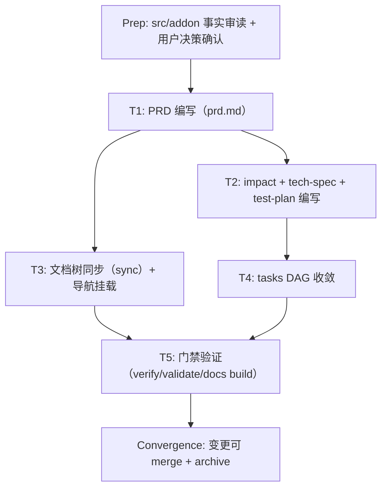

<!-- Replace every marked prompt before verifying this stage. Split work into vertical tracer-bullet tasks with an explicit DAG dependency graph and complete every checkbox. -->

# Preparation

## Parallel Execution Strategy

- **Sequential Baseline**: `src/addon/` v0.5.0 事实审读与用户决策（现状还原型、Out of Scope 策略、产物路径）先行完成，作为全部任务前置基线。
- **Parallel Slices**: T1（PRD 主体）完成后，T2（生命周期工件）与 T3（文档树同步/导航）相互独立，文档已就绪后并行无冲突；本仓库单执行者，实际顺序执行。
- **Convergence & Verification**: T4 汇总 tasks 状态后由 T5 统一跑 verify / validate / docs build。

## Tasks

- [x] **T1: 编写产品级 PRD（prd.md）**
  - [x] 审读 `src/addon/` 关键模块并提取 9 大能力域事实
  - [x] 按模板填写 Goal / Users / Scope / Requirements（24 条）/ Acceptance Criteria（6 场景）/ Success Metrics / Risks
  - [x] `cabbage verify product-prd-v1 requirement` 通过

- [x] **T2: 编写生命周期工件（impact / tech-spec / test-plan）**
  - [x] impact.md：影响矩阵（product=true 已 set）与文档更新计划（Impact Matrix、Risks 齐备）
  - [x] tech-spec.md：Context / Design / Testing Decisions / Alternatives / Failure Modes 齐备
  - [x] test-plan.md：Strategy / Cases（T-1~T-6）/ Regression / Non-functional 齐备
  - [x] 各阶段 `verify` 通过

- [x] **T3: 文档树同步 + 导航挂载**
  - [x] `cabbage sync product-prd-v1` 生成 `docs/01-product/prd/product-prd-v1.md`
  - [x] `.vitepress/config.ts` sidebar 加入"产品级 PRD（现状基线）"条目
  - [x] `docs/README.md` 01-product 目录表格更新为新 PRD 入口
  - [x] 既有 `add-input-method-icon.md` / `out-of-scope.md` 未受影响

- [x] **T4: tasks DAG 收敛**
  - [x] 按 tidy-docs-tree 惯例补全本 DAG 与全部 checklist 勾选

- [x] **T5: 门禁验证**
  - [x] `cabbage verify product-prd-v1 impact/design/tests/implementation` 全部通过
  - [x] `cabbage validate --all` 输出 VALID
  - [x] `pnpm --dir docs build` 构建成功、导航链接有效

### Convergence

- 全部任务已完成，产物齐全且同步；待 merge 后执行 `cabbage archive product-prd-v1`。