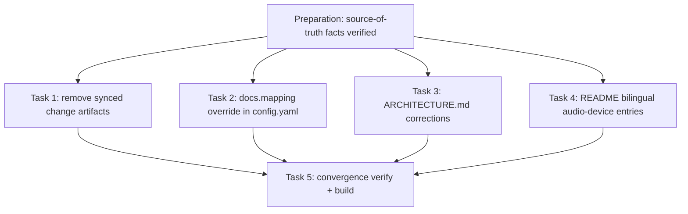

# Preparation

## Parallel Execution Strategy

- **Sequential Baseline**: 源码事实核实（`AudioSource` 已移除、`src/addon/config/` 现状、PR #20 编号）已在 design 阶段完成并记录于 tech-spec Context，作为全部任务的前置基线。
- **Parallel Slices**: Task 1~4 相互无依赖（不同文件集合），可并行执行。
- **Convergence & Verification**: Task 5 汇总全量门禁验证。

- [x] 核实源码事实基线：`voiceinput-config.h` 无 `AudioSource` 键；`pulse_audio_capture.cpp` 的 `FindBestSourceName()` 自动选源逻辑；`src/addon/config/` 仅有 `voiceinput-config.h`；`-z,now` 兼容对应 PR #20

# Tasks

## Task 1: Remove synced change artifacts from docs tree
- **Builds**: `docs/01-product/`、`docs/03-architecture/system-design/`、`docs/08-testing/` 三个分区不再含变更工作区产物，分区语义回归纯粹（产品文档 / 当前态架构设计 / 空置测试区）
- **Blocked By**: None (Preparation)
- **Parallel Group**: Group 1
- **Verification**: `git status --short` 仅含 3 个 `D docs/**/adopt-existing-docs.md`；`grep -rn "adopt-existing-docs" docs/ README.md README.zh-CN.md` 无命中
- [x] `git rm docs/01-product/adopt-existing-docs.md docs/03-architecture/system-design/adopt-existing-docs.md docs/08-testing/adopt-existing-docs.md`
- [x] 全仓扫描确认无站内入链残留（归档区 `.cabbage/archive/` 内部记录除外）

## Task 2: Close the sync leak in .cabbage/config.yaml
- **Builds**: 后续任何变更执行 `cabbage sync`/`archive` 时，tech-spec / test-plan / release-plan 不再写入 `docs/`；PRD 若有则归档至 `docs/01-product/prd/`；adr/rfc/api/database/security 同步行为保持 tooling 默认
- **Blocked By**: None (Preparation)
- **Parallel Group**: Group 1
- **Verification**: `cabbage status tidy-docs-tree && cabbage validate --all` 正常解析配置（无 invalid YAML）；`grep -A6 "^docs:" .cabbage/config.yaml` 显示 mapping 覆盖
- [x] 在 `.cabbage/config.yaml` 的 `docs:` 段新增 `mapping`：`requirement: '01-product/prd/{change_id}.md'`，`design`/`tests`/`release` 置空
- [x] 运行任意 cabbage 命令确认 YAML 可解析、CLI 行为正常

## Task 3: Correct ARCHITECTURE.md against source code
- **Builds**: `docs/03-architecture/system-design/ARCHITECTURE.md` 的配置目录树、音频设备描述、Route Map 措辞、PR 引用与 `src/addon/` 现状一致
- **Blocked By**: None (Preparation)
- **Parallel Group**: Group 2
- **Verification**: 对照 `src/addon/config/`、`src/addon/capture/pulse_audio_capture.cpp` 人工核对 T-4 清单；`grep -n "AudioSource\|config.h\|flow/" docs/03-architecture/system-design/ARCHITECTURE.md` 无过时表述命中
- [x] 配置目录树移除不存在的 `config.h` 桥接头，仅保留 `voiceinput-config.h`
- [x] `AudioSource` 描述改写为自动选源现状（`pactl list sources short`，优先 `alsa_input.*`，排除 `.monitor`/`echoCancel`）
- [x] Route Map "flow/非流式" 改为 "流式/非流式"
- [x] "详见过往 PR" 补充为 "详见 PR #20"

## Task 4: Rewrite bilingual README audio-device notes
- **Builds**: `README.zh-CN.md` 与 `README.md` 的"注意事项/Notes"不再引导用户使用已移除的 `AudioSource` 下拉框，改述自动选源行为，中英文语义一致
- **Blocked By**: None (Preparation)
- **Parallel Group**: Group 2
- **Verification**: `grep -n "AudioSource" README.md README.zh-CN.md` 无命中；人工比对中英文条目语义
- [x] 中文条目改写：自动选择系统音频输入设备，暂不支持手动指定
- [x] 英文条目改写：auto-selected at startup, manual device selection not supported yet

## Task 5: Convergence verification and merge readiness
- **Builds**: 全部改动经过门禁证明，变更达到 merge gate 就绪
- **Blocked By**: Task 1, Task 2, Task 3, Task 4
- **Parallel Group**: Convergence
- **Verification**: `cabbage validate --all && cabbage docs build && cabbage gate tidy-docs-tree merge`
- [x] 执行 `cabbage validate --all`（退出码 0）
- [x] 执行 `cabbage docs build`（退出码 0）
- [x] 执行 `cabbage gate tidy-docs-tree merge`（退出码 0）
- [x] 本 tasks.md 全部勾选并重新 verify implementation

# Verification

- [x] 已执行并记录 `cabbage validate --all`、`cabbage docs build`、`cabbage gate tidy-docs-tree merge` 三条命令的退出码
- [x] 回滚就绪：整个 PR 可 `git revert`，无需数据迁移（见 tech-spec Rollback）
