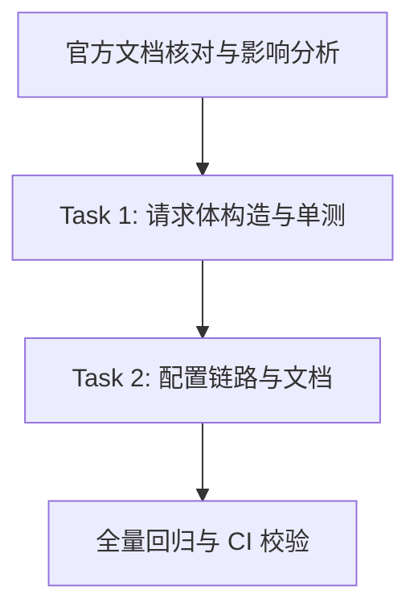

# Preparation

## Parallel Execution Strategy

- **Sequential Baseline**: 核对 MiMo 官方 API 文档与现有 chat 模式差异。
- **Parallel Slices**: 本变更规模小，代码与文档按单线推进，不做并发拆分。
- **Convergence & Verification**: 本地 ctest 全量、Cabbage CI 校验、远端矩阵。

- [x] 调研 MiMo 云 API 协议与现有 chat 模式差异（结论见同目录 impact.md 与 tech-spec.md）

# Tasks

## Task 1: 请求体构造与单测
- **Builds**: chat 模式按配置发送 language、可选 enable_itn 的请求体
- **Blocked By**: None
- **Parallel Group**: Group 1
- **Verification**: `ctest --test-dir build -R chat_asr_request_test`
- [x] 新增 `src/addon/asr/utils/chat_asr_request.{h,cpp}` 纯函数
- [x] 新增 `tests/chat_asr_request_test.cpp` 四组用例并接入 tests/CMakeLists.txt
- [x] `openai_asr.cpp` chat 分支改为调用纯函数，修复 language 覆盖

## Task 2: 配置链路与文档
- **Builds**: `EnableItn` 从配置到请求的完整链路与接入说明
- **Blocked By**: Task 1
- **Parallel Group**: Group 2
- **Verification**: `cmake --build build -j$(nproc)`
- [x] `OpenAIAsrConfig.EnableItn` 与 `AsrEngine::Config.enableItn` 贯通
- [x] 更新 ARCHITECTURE / README / CHANGELOG / 调研文档
- [x] 登记 `docs/08-testing/README.md`

- [x] Add or update automated regression tests
- [x] Update affected current-state documentation under docs/

# Verification

- [x] `cmake -B build -DBUILD_TESTS=ON && cmake --build build -j$(nproc) && ctest --test-dir build --output-on-failure`（12/12 通过）
- [x] `PYTHONPATH=.cabbage/tooling python3 -m cabbage_cli ci --base origin/main`（本地 Cabbage 校验）
- [x] 实网 MiMo 转录列为待办（无 API Key），已在 test-plan 退出条件与调研 §9 标注
