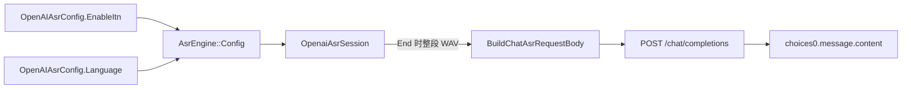

# Context

## Current State

`OpenaiAsrSession::TranscribeWorker()` 的 chat 分支内联构造 JSON：WAV 转 base64
Data URL 放入 `messages[].content[].input_audio`，POST `{baseUrl}/chat/completions`，
解析 `choices[0].message.content`。缺陷：`body["asr_options"] = asrOpts`（仅含
`enable_itn`）会整体覆盖此前写入的 `language`，导致 language 从未发送；
`enable_itn` 是 DashScope 扩展字段，却被硬编码发送。

MiMo-V2.5-ASR 云 API 事实（官方文档）：OpenAI 兼容；`asr_options` 仅定义
`language`（auto/zh/en）；鉴权 `api-key` 或 `Authorization: Bearer`；仅 wav/mp3，
base64 不超过 10MB；`stream=true` 只是输出 SSE；无实时音频输入。

## Goals and Non-goals

- Goal: 修复 chat 模式 `asr_options` 构造；`language` 按配置发送、`enable_itn`
  可关闭；MiMo 通过现有 openai 后端零新代码接入。
- Non-goal: 新增 `mimo` 一等后端；WebSocket 实时音频；`stream=true` 增量展示；
  放宽 HTTP 超时。

# Requirements

| ID | Technical requirement | Source |
|---|---|---|
| TR-1 | `language` 非 auto/空时必须出现在 `asr_options` | 调研 C9；MiMo 官方 API 文档 |
| TR-2 | `enable_itn` 仅在启用时发送，默认保持 DashScope 行为 | 调研 §5.2 |
| TR-3 | 无任何 `asr_options` 字段时整个对象省略 | 规避严格校验端点的空对象行为 |
| TR-4 | 请求体构造为可单测纯函数，不依赖网络与全局状态 | 项目测试约定（无外部依赖） |
| TR-5 | 沿用 Bearer 鉴权、WAV 封装与既有超时/取消语义 | 现有实现；官方 FAQ |

# Design

## Overview

新增 `src/addon/asr/utils/chat_asr_request.{h,cpp}`：

```cpp
Json::Value BuildChatAsrRequestBody(const std::string& model,
                                    const std::string& language,
                                    bool enableItn,
                                    const std::string& audioDataUrl);
```

`OpenaiAsrSession` 构造时记录 `enableItn_`，chat 分支改为调用该函数并序列化。
配置链路：`OpenAIAsrConfig.EnableItn` → `AsrEngine::Config.enableItn` → session。



## Interfaces and Data

- 不变：端点拼装、Data URL MIME（`audio/wav`）、响应解析、30s 超时、取消回调。
- 变化：`asr_options` 字段按参数生成；`auto`/空 language 省略；`enableItn=false`
  省略 `enable_itn`；两者皆无时省略 `asr_options`。
- 兼容性：默认 `EnableItn=true`，DashScope 请求恢复为「language（用户设置时）+
  enable_itn」；此前 language 缺失属缺陷。

# Alternatives

| Option | Benefits | Costs and risks | Decision |
|---|---|---|---|
| 维持内联构造（现状） | 零改动 | language 丢失无法修复，MiMo 不可用，不可单测 | 拒绝 |
| 新增独立 `mimo` 后端 | 配置隔离、可独立放宽超时 | 复制 HTTP 路径、新增配置面与后端枚举，超出本次范围 | 拒绝（触发条件见调研 §9） |
| 抽出纯函数 + ITN 可配 | 可单测、零新依赖、复用既有后端 | 触及现有 chat 请求构造 | 采纳 |

# Security and Privacy

- 信任边界不变：BaseUrl/API Key 由 libcurl 发送，非 TLS 时保留既有明文告警。
- 不新增日志；API Key 仍仅存在于内存与受权限保护的本地配置文件。
- 音频上传到用户选择的上游（MiMo 时上传小米），README 已说明 chat 模式为整段上传。

# Observability

| Signal | Purpose | Alert or dashboard |
|---|---|---|
| `CreateAsrEngine` INFO 日志新增 `enableItn=` | 证明运行期配置生效 | 无（本地插件日志） |
| 既有 HTTP 状态码与响应长度 DEBUG 日志 | 诊断 4xx/5xx | 无 |

# Failure Modes

| Failure mode | Detection | Handling | Recovery |
|---|---|---|---|
| MiMo 拒绝 `enable_itn` | HTTP 400 与 `error.message` | 结果为空、不上屏 | 用户关闭 `EnableItn` 后重试 |
| 鉴权失败 | HTTP 401 | 空结果与错误回调 | 检查 API Key |
| 30s 超时 | `CURLE_OPERATION_TIMEDOUT` | 会话以空结果结束 | 使用较短语音段，后续按需评估放宽超时 |

# Rollout

无开关、无迁移：随版本发布；默认行为与既有 DashScope 路径兼容，MiMo 用户按
README 配置。

# Rollback

回滚即还原提交：请求体构造与配置字段恢复原状，无数据迁移与外部契约影响。

# Open Questions

- 待实网确认：MiMo 对 `enable_itn` 的容忍度、Bearer 可用性、30s 超时是否足够
  （当前无 API Key，见调研 §9 与 test-plan 退出条件）。
