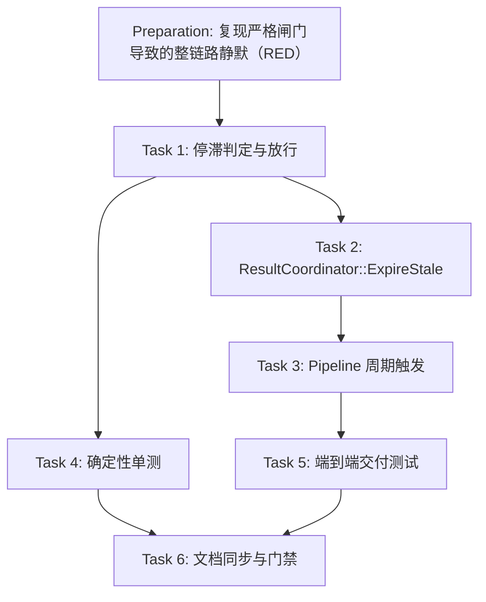

# Preparation

## Parallel Execution Strategy

- **Sequential Baseline**: 先用注入时间的单测确认「段 1 卡死 → 后续 4 段 0 交付」（RED）。
- **Parallel Slices**: Task 2/3 是接线，Task 4 是确定性单测，均依赖 Task 1 的判定逻辑。
- **Convergence & Verification**: Task 5 端到端验证完整交付链路，Task 6 同步文档并通过门禁。

- [x] RED 确认：把 `HeadStalledLocked` 返回值改为恒 `false`（等价于修复前的严格闸门），T-2 失败（`expiring a stalled head must release it and all later results`）。

# Tasks

## Task 1: 停滞判定与放行（ordered_result_buffer.h）
- **Builds**: 队首停滞的可判定化与超时放行（含错误结果下推与迟到丢弃）。
- **Blocked By**: None
- **Parallel Group**: Group 1
- **Verification**: `ctest -R ordered_buffer_stall_test`
- [x] `PendingUtterance` 增加 `lastSeen`；`SubmitAt`/`SkipAt` 更新该时间戳。
- [x] `HeadStalledLocked(now)`：取「队首 `lastSeen`」与「最早的被阻塞后续段 `lastSeen`」中更早者为停滞起点（覆盖「出过 partial 后静默」与「完全不应答」两种形态）；队首已有 terminal 时直接返回 false。
- [x] `ExpireHeadLocked(now)`：清缓存增量，写入 `isError` 结果（沿用该段结果的 generation/sessionId，或借用最早被阻塞段的元信息），置 `terminal = true`。
- [x] `DrainReadyLocked(now)`：队首有 terminal 正常排空；否则先交付已缓存增量（partial 立即可见）再检查停滞；停滞时放行并 `continue`（可连续推进多段）。
- [x] 提供 `SubmitAt`/`SkipAt`/`ExpireStaleAt` 可注入时间基准的变体，公开方法 `Submit`/`Skip`/`ExpireStale` 用 `steady_clock::now()` 转发。

## Task 2: ResultCoordinator 入口
- **Builds**: 汇聚层可周期触发停滞检查并通知主线程。
- **Blocked By**: Task 1
- **Parallel Group**: Group 2
- **Verification**: `ctest -R ordered_buffer_stall_test`
- [x] 新增 `ResultCoordinator::ExpireStale()`：`accepting_` 时调用 `orderedResults_.ExpireStale()` 并在有结果时 `Notify`（锁外通知，保持既有约定）。
- [x] 构造函数接受 `maxStall`（默认 `OrderedResultBuffer::kDefaultMaxStall`），便于测试注入小阈值。

## Task 3: Pipeline 周期触发
- **Builds**: 卡死段此后不再有回调时仍能被放行。
- **Blocked By**: Task 2
- **Parallel Group**: Group 3
- **Verification**: 构建 + `ctest`
- [x] `AsrDispatcherLoop` 在 `speechEventQueue_.TryPop` 失败（空闲）时，每 500ms 调用一次 `results_->ExpireStale()`。

## Task 4: 确定性单测
- **Builds**: 停滞语义的完整覆盖（阈值内不误伤、超阈值放行、迟到丢弃、多段连续、Skip 不变）。
- **Blocked By**: Task 1
- **Parallel Group**: Group 2
- **Verification**: `ctest -R ordered_buffer_stall_test`
- [x] 新增 `tests/ordered_buffer_stall_test.cpp`：T-1..T-7 七个确定性用例（注入 `steady_clock::time_point`）。
- [x] 注册到 `tests/CMakeLists.txt`。

## Task 5: 端到端交付测试
- **Builds**: 「卡死段 + 4 段正常」在 `ResultCoordinator` 层的完整交付。
- **Blocked By**: Task 2
- **Parallel Group**: Group 3
- **Verification**: `ctest --test-dir build --output-on-failure`
- [x] T-8：`ResultCoordinator(50ms)` + 5 段会话（段 1 卡死），验证阈值内只交付 partial、`ExpireStale()` 后放出 1 条超时错误 + 4 条正常且顺序正确。

- [x] 既有 9 个测试无回归：`ctest` 10/10 通过。
- [x] 更新 `docs/03-architecture/system-design/ARCHITECTURE.md`、`docs/08-testing/README.md`、`docs/13-operations/troubleshooting.md`。

# Verification

- [x] `cmake -B build -DCMAKE_BUILD_TYPE=Release -DBUILD_TESTS=ON && cmake --build build -j$(nproc)`：构建通过。
- [x] `ctest --test-dir build --output-on-failure`：10/10 通过。
- [x] 关键场景实测（`OrderedResultBuffer(1000ms)`，注入时间）：900ms 时放行 0 条；1000ms 时放出 5 条 = `uid=1 err=1` + `x,x,x,x`（段 2..5 顺序正确）。
- [x] 突变验证（RED）：`HeadStalledLocked` 恒 false → T-2 失败；恢复后通过。
- [x] `cabbage validate ordered-buffer-timeout-skip` 与 `cabbage gate ordered-buffer-timeout-skip merge` 通过。
- [x] 回滚就绪性：无持久化状态、无配置项、无外部契约变化，revert 即为回滚。
