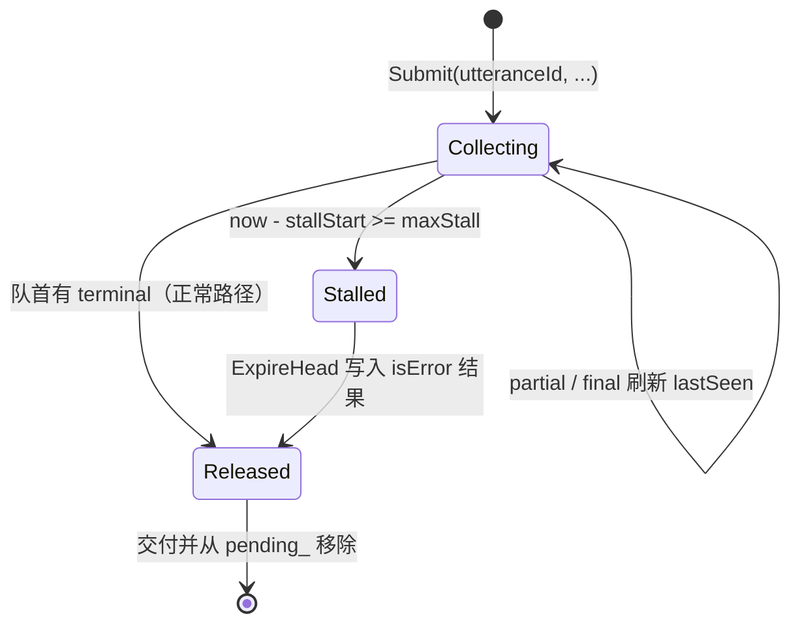

# Context

## Current State

`OrderedResultBuffer` 是严格串行闸门：`Submit()` 只从 `nextUtteranceId_` 开始 `DrainReadyLocked()`，队首没有 terminal 结果时后续结果一律暂存不下发。`ResultCoordinator` 也只在 `SkipSession()` / `SkipUtterance()` 被显式调用时才推进闸门，而这两个入口只在 pipeline 的 Cancel/替换会话等路径触发。

因此 issue #43 的场景（第 1 个连接完全不应答、后续连接正常回 `completed`）会得到：5 段语音累计交付 0 条，用户只能切走再切回输入法（Stop/Start 重置）才恢复。实测复现见 issue 正文：

```
=== pipeline-freeze ===
  段#1 (sid=1): 累计交付 0 条结果
  ...
  段#5 (sid=5): 累计交付 0 条结果
  引擎触发容量取消次数=0（=0 表示卡死会话不会被兜底取消）
```

补充事实（issue 已指出）：`AsrEngine::CancelOldestSessionIfLimitReachedLocked()` 的容量兜底（`kMaxActiveSessions=3`）在真实生命周期下不会触发——已结束会话的 `weak_ptr` 条目在下一次 `StartSession` 清理时被移除，`sessions_.size()` 长期只有 1，因此不能依赖它兜底。

## Goals and Non-goals

- Goal: 某段长时间无终态时，该段以超时错误放行，后续段结果在有界时间内按序上屏（issue 验收 1）。
- Goal: 正常路径保持严格保序，不引入乱序上屏（issue 验收 2）。
- Goal: 放行后卡死段的迟到结果不得扰乱已推进的闸门。
- Non-goal: 不改 partial 的可见性策略（partial 仍立即可见；issue 修复方向 2 的备选方案）。
- Non-goal: 不改会话侧终态保证（已由 PR #46 的 End 预算覆盖，见 issue 修复方向 3）。
- Non-goal: 不引入配置项（阈值先按常量固化在 `OrderedResultBuffer`）。

# Requirements

| ID | Technical requirement | Source |
|---|---|---|
| TR-1 | 单个语音段停滞超过阈值时放行闸门 | issue #43 修复方向 1 |
| TR-2 | 放行时该段必须有可见的终态（超时错误），不能静默丢弃 | issue 验收 1「或明确降级为错误提示」 |
| TR-3 | 阈值内不误伤；正常路径保序语义不变 | issue 验收 2 |
| TR-4 | 放行后卡死段的迟到结果被丢弃 | 保序一致性 |
| TR-5 | 「队首从未产生任何结果」与「队首出过 partial 后停顿」都要能判定停滞 | issue 的两种触发形态 |
| TR-6 | 判定逻辑必须可确定性测试（不依赖真实等待） | 工程可验证性 |

# Design

## Overview

在 `OrderedResultBuffer` 内引入两点：

1. **进展时间戳**：`PendingUtterance::lastSeen` 记录该段最后一次回调时刻（`SubmitAt`/`SkipAt` 更新）。
2. **停滞判定与放行**：`HeadStalledLocked(now)` 计算队首的停滞起点，`ExpireHeadLocked(now)` 执行放行。

停滞起点取两者中**更早**者：

- 队首自身的 `lastSeen`（覆盖「出过一个 partial 后彻底静默」）；
- **最早的被阻塞后续段**的 `lastSeen`（覆盖「队首完全不应答，而后续段已完成并被扣住」）。

放行动作：清掉该段缓存的增量结果，写入一条 `isError = true` 的结果，`terminal = true`，随后 `DrainReadyLocked` 正常推进（可连续推进多个已停滞段）。



**触发方式**：`Submit`/`Skip` 内部调用 `DrainReadyLocked(now)` 时顺带检查；此外 `ResultCoordinator::ExpireStale()` → `OrderedResultBuffer::ExpireStale()` 供外部周期性触发。`Pipeline::AsrDispatcherLoop` 在语音事件队列空闲（`TryPop` 失败）时每 500ms 调用一次——**这是必需的**：若被阻塞段此后不再有任何回调（正是卡死场景），就没有提交动作能触发检查。

## Interfaces and Data

```cpp
class OrderedResultBuffer {
public:
    static constexpr std::chrono::milliseconds kDefaultMaxStall{40000};
    explicit OrderedResultBuffer(std::chrono::milliseconds maxStallMs = kDefaultMaxStall);

    void Reset(uint64_t firstUtteranceId);
    std::vector<AsrResult> Submit(AsrResult result, bool terminal);
    std::vector<AsrResult> Skip(uint64_t utteranceId);
    std::vector<AsrResult> ExpireStale();          // 周期检查入口

    // 可注入时间基准（确定性测试）
    std::vector<AsrResult> SubmitAt(AsrResult, bool terminal, TimePoint);
    std::vector<AsrResult> SkipAt(uint64_t, TimePoint);
    std::vector<AsrResult> ExpireStaleAt(TimePoint);

private:
    struct PendingUtterance {
        std::deque<AsrResult> results;
        bool terminal = false;
        bool skipped = false;
        std::chrono::steady_clock::time_point lastSeen{};
    };
    bool HeadStalledLocked(TimePoint) const;
    std::optional<TimePoint> EarliestBlockedSinceLocked() const;
    void ExpireHeadLocked(TimePoint);
    std::vector<AsrResult> DrainReadyLocked(TimePoint);
};

class ResultCoordinator {
    explicit ResultCoordinator(std::chrono::milliseconds maxStall =
                                   OrderedResultBuffer::kDefaultMaxStall);
    void ExpireStale();  // 放行停滞段，必要时 Notify
};
```

**不变量**

- 阈值内：`DrainReadyLocked` 只交付队首已缓存的增量（partial 立即可见），闸门不前进（TR-3）。
- 队首有 terminal 时 `HeadStalledLocked` 直接返回 false，仅走正常排空路径（不误报超时）。
- 放行产生的结果 `generation` 沿用该段既有结果（或最早被阻塞段的元信息），确保通过 `engine.cpp` 的 generation 过滤后仍能上屏（TR-2）。
- 放行后 `nextUtteranceId_` 已推进，卡死段的迟到结果命中 `result.utteranceId < nextUtteranceId_` 分支被丢弃（TR-4）。
- `skipped`（显式跳过）不产生 `isError` 结果；只有停滞放行才产生（保持既有语义）。

**阈值取值 40s 的推导**

| 合法慢路径 | 上界 | 说明 |
|---|---|---|
| ASR End 路径（发送 + 等待终态） | 8s | `WsEndBudget::kDefaultTotal`（PR #46） |
| 非流式 LLM 后处理 | 30s | `LLMClient` 的 `CURLOPT_TIMEOUT` |
| 流式 LLM 后处理 | 持续 token 刷新 `lastSeen` | 进度驱动，不受阈值影响 |

30s（LLM 上界）+ 调度余量 → 40s 不会误伤；同时远小于用户「切走再切回」的心智阈值。

# Alternatives

| Option | Benefits | Costs and risks | Decision |
|---|---|---|---|
| 现状（只靠显式 Skip） | 零改动 | 单段卡死 = 整链路静默，且容量兜底在真实生命周期下不触发 | 拒绝：issue #43 已实测 |
| 让 partial 不参与保序（只 final 保序） | 后续段有可见反馈更早 | 需重新定义 partial 与 final 的交付契约，可能引入乱序观感；不解决「final 被扣住」 | 拒绝：改动面大且不满足验收 1 的「有界时间内上屏」 |
| 只靠会话侧保证终态（配合 #42） | 从根因消除 | 无法覆盖「上游丢 final 帧」等继续存在的形态（issue 触发条件 2） | 拒绝：需与本题兜底并存 |
| 停滞超时放行（本设计） | 有界；有明确错误提示；正常路径不变 | 需要周期触发点与阈值选择 | 采纳 |
| 放行时静默丢弃该段 | 实现更简单 | 用户无法区分「失败」与「卡死」，且 preedit 可能残留 | 拒绝：违反 TR-2 |

# Security and Privacy

无新增信任边界。超时结果只含元信息（generation/sessionId/utteranceId），不含转写内容。

# Observability

| Signal | Purpose | Alert or dashboard |
|---|---|---|
| `ResultCoordinator` 的 `Notify(text)`（超时结果 text 为空） | 触发主线程 `PollResults`，进而显示「语音识别失败」 | 用户可见信号（状态栏） |
| 超时结果带 `isError = true` | 与正常结果区分，走既有错误分支（清 preedit + 提示） | 与既有 ASR 空结果路径一致 |

# Failure Modes

| Failure mode | Detection | Handling | Recovery |
|---|---|---|---|
| 某段卡死（无任何回调） | 该段 `lastSeen` 长期不更新 / 无该段条目 | 超过 40s 时以超时错误放行，推进闸门 | 后续段立即按序上屏 |
| 某段出了 partial 后静默 | `lastSeen` 停在 partial 时刻 | 同上 | 同上 |
| 连续多段卡死 | `DrainReadyLocked` 循环内连续判定 | 一次排空可连续放行多个超时段 | 无需人工干预 |
| 放行后卡死段迟到终态 | `utteranceId < nextUtteranceId_` | 丢弃 | 无 |
| 正常慢路径（LLM 非流式 30s） | `lastSeen` 停止刷新但未超阈值 | 阈值内不放行 | 正常上屏 |

# Rollout

单 PR 交付，无开关、无配置项、无数据迁移。顺序：缓冲区停滞逻辑 → `ResultCoordinator` 入口 → `Pipeline` 周期触发 → 测试 → 文档。成功判据：`ordered_buffer_stall_test` 通过（阈值内不放行、超阈值一次放出全部后续段且顺序正确、迟到结果被丢弃），既有 9 个测试无回归。

# Rollback

revert 本 PR 即回滚：`OrderedResultBuffer` 恢复严格闸门、移除 `ExpireStale()` 与分发循环的周期检查、删除测试与文档段落。回滚后 issue #43 的行为复现（单段卡死 → 整链路静默）。

# Open Questions

- 阈值是否应暴露为配置项？当前无用户诉求；LLM 的 30s 超时是主要约束来源，若未来可配置 LLM 超时，应同步让停滞阈值跟随（当前以 `kDefaultMaxStall` 集中定义，便于后续调整）。
- 是否需要把停滞放行事件写入日志（当前只有状态栏提示）？日志对定位「哪个段卡死」有帮助，但会引入新的日志格式约定；留待有实际排查需求时补充。
