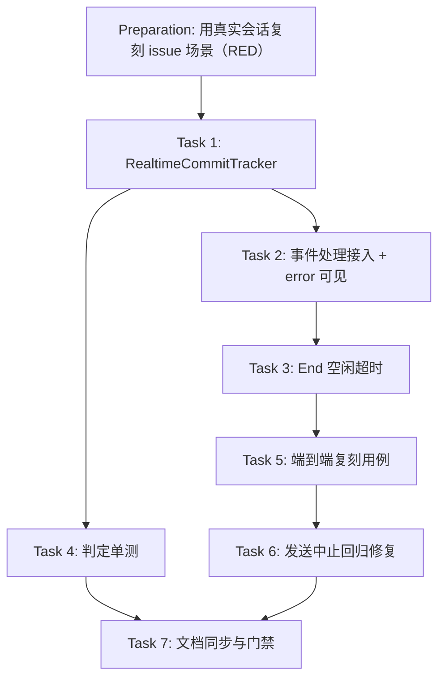

# Preparation

## Parallel Execution Strategy

- **Sequential Baseline**: 先用真实 `RealtimeAsrSession` + 假服务端复刻 issue 场景确认 RED。
- **Parallel Slices**: Task 4（判定单测）与 Task 2/3（接线）可并行；Task 6 由 Task 5 暴露。
- **Convergence & Verification**: Task 5 端到端验证修复效果，Task 7 同步文档并通过门禁。

- [x] RED 确认：以修复前的 `realtime_asr.cpp`（内含 `commitsInFlight` 计数实现）运行 Task 5 的用例，实测 `final=1 text="" after 30ms`，断言「文本必须是服务端转写」失败——比 issue 描述的 30s 兜底更早收尾，说明该场景同时受另一处回归影响（见 Task 6）。

# Tasks

## Task 1: RealtimeCommitTracker（src/addon/asr/utils/realtime_commit_tracker.h）
- **Builds**: 按 item_id 追踪在途 item 的判定组件，替代内联计数器。
- **Blocked By**: None
- **Parallel Group**: Group 1
- **Verification**: `ctest -R realtime_commit_tracking_test`
- [x] `OnCommitted(itemId, endCommitSent)`：以服务端确认登记在途 item；End commit 已发出时记下首个确认的 item 作为 End item。
- [x] `OnCompleted(itemId)`：按四条优先级规则判定最终 item 并移除；`OnFailed(itemId)` 只移除对应项；空 itemId 不做移除。
- [x] 导出 `kEndIdleTimeout = 5s`（End 等待空闲超时常量）。

## Task 2: 事件处理接入 + error 可见
- **Builds**: 用 tracker 替换计数器；error 事件进入日志与错误回调。
- **Blocked By**: Task 1
- **Parallel Group**: Group 2
- **Verification**: `ctest -R "realtime_commit"` 
- [x] 删除 `commitsInFlight` 与 `endCommitSent` 局部变量，改用 `RealtimeCommitTracker commits` 与 `commits.MarkEndCommitSent()`。
- [x] 新增 `DescribeError(json)`：依次取 `error.message` → `error.code` → `error.type` → 顶层 `message`。
- [x] `error` 事件分支：`FCITX_WARN` 打印（含 session）并经 `errorCb_` 上报；`failed` 分支的错误信息也带上原因。
- [x] 每次成功解析服务端事件时刷新 `lastServerEventAt`。

## Task 3: End 空闲超时
- **Builds**: 固定 30s 硬等待 → 以「最后服务端事件」为基准的空闲超时。
- **Blocked By**: Task 2
- **Parallel Group**: Group 2
- **Verification**: `ctest -R realtime_commit`
- [x] End 等待循环条件由固定截止改为 `!endBudget_.Expired() && !endWaitIdleExpired()`（`endWaitIdleExpired` 基于 `kEndIdleTimeout`）。
- [x] 日志与注释同步（说明总预算 8s、空闲 5s、reaper 15s 三者关系）。

## Task 4: 判定与常量的确定性单测
- **Builds**: T-1..T-8 覆盖（含四条判定规则、failed 精确移除、空 item_id、常量关系与 `Arm` 幂等）。
- **Blocked By**: Task 1
- **Parallel Group**: Group 2
- **Verification**: `ctest -R realtime_commit_tracking_test`
- [x] 新增 `tests/realtime_commit_tracking_test.cpp`（9 个用例）并注册到 `tests/CMakeLists.txt`（仅需 include 头文件，无链接依赖）。

## Task 5: 端到端复刻用例（T-9）
- **Builds**: 真实会话在 issue 场景下 final 的到达时间与文本正确性。
- **Blocked By**: Task 2, Task 3
- **Parallel Group**: Group 3
- **Verification**: `ctest -R realtime_commit_e2e_test`
- [x] 新增 `tests/realtime_commit_e2e_test.cpp`：`CommitErrorWsServer` 解析客户端 TEXT 帧（含掩码），第 1 次 commit 回 error，第 2 次不回 ack、80ms 后回最终 completed。
- [x] 断言 final 文本为 `最终文本` 且耗时 < 3s；无 WS 支持时跳过并返回 0。

## Task 6: End 期间发送中止的回归修复
- **Builds**: End 到达时被中止的推流发送不再被当作传输失败。
- **Blocked By**: Task 5（由该用例暴露）
- **Parallel Group**: Group 3
- **Verification**: `ctest -R realtime_commit_e2e_test`
- [x] Realtime 的周期 commit / 音频 append 发送失败分支：若 `finished || cancelled`，改为 `continue`（回到循环顶部消费 End 哨兵），不置 `reconnectNeeded`。
- [x] Mistral 的周期 flush / 音频 append 发送失败分支同一处理。

- [x] 既有 9 个测试无回归：`ctest` 11/11 通过。
- [x] 更新 `docs/03-architecture/system-design/ARCHITECTURE.md`、`docs/08-testing/README.md`、`docs/13-operations/troubleshooting.md`、`docs/01-product/prd/product-prd-v1.md`。

# Verification

- [x] `cmake -B build -DCMAKE_BUILD_TYPE=Release -DBUILD_TESTS=ON && cmake --build build -j$(nproc)`：构建通过。
- [x] `ctest --test-dir build --output-on-failure`：11/11 通过。
- [x] T-9 实测（修复后）：`commit-error: final=1 text="最终文本" after 161ms`（另一次运行 192ms）。
- [x] T-9 RED（修复前代码）：`commit-error: final=1 text="" after 30ms` → 断言失败。
- [x] T-3 突变验证：判定规则 3 替换为「按集合清空」后单测失败；恢复后通过。
- [x] `cabbage validate realtime-commit-tracking` 与 `cabbage gate realtime-commit-tracking merge` 通过。
- [x] 回滚就绪性：无持久化状态、无配置项；回滚需注意会同时恢复 Task 6 修复的回归。
