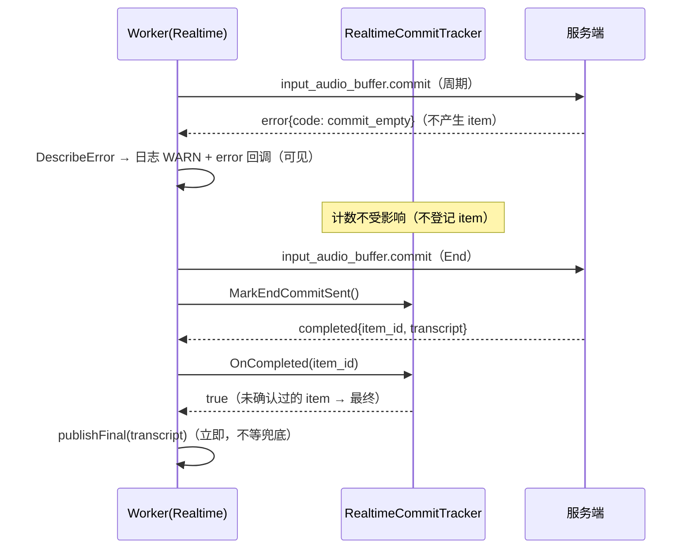

# Context

## Current State

Realtime 后端在连接循环内用局部计数器判断最终 item：

```cpp
int commitsInFlight = 0;  // 在途 commit 数
...
// completed 分支
bool isFinalItem = endCommitSent && commitsInFlight <= 1;
if (commitsInFlight > 0) --commitsInFlight;
...
// failed 分支
if (commitsInFlight > 0) --commitsInFlight;
// 其他事件（response.*/error 等）忽略   ← error 不递减
```

三处缺陷（对应 issue #44 的三个验收标准）：

1. **计数漂移**：`input_audio_buffer.commit` 在本地发送成功时 `++`，但只有 `completed`/`failed` 会 `--`。服务端对空 buffer 的 commit 回 `error`（`input_audio_buffer_commit_empty`）时计数永久虚高 → `isFinalItem` 恒为 false → 最终 completed 被当作周期结果（仅刷新 preedit），会话只能等兜底。
2. **error 完全静默**：只剩一句注释「其他事件（response.*/error 等）忽略」，用户与日志都无法区分「网络慢」与「服务端拒绝」。
3. **固定 30s 兜底**：End 后用 `deadline = now + 30s` 硬等待，即使上游早已无响应也要等满。

issue 实测输出（复刻场景：周期 commit 回 error，End commit 后 200ms 内补发最终 completed）：

```
  [cb] final=no len=12
W... End wait timeout session=1
  [cb] final=yes len=12
  final 在 End() 后 30037ms 到达（文本="最终文本"）
```

**修复过程中新发现的回归（本变更一并修复）**：在复刻 issue 场景时，新增的端到端用例暴露出 PR #46 引入的一个问题——End 到达时推流中的 `append`/`commit` 发送因 `WsAbort::CancelOrFinished` 看到 `finished` 而中止，代码把它当作「传输失败」置 `reconnectNeeded`，于是跳出连接循环、跳过 End 收尾路径（flush + commit + 等待终态），在 30ms 内以空文本提前收尾。修复前代码实测：

```
  commit-error: final=1 text="" after 30ms
the published text must be the server transcript
```

## Goals and Non-goals

- Goal: error 事件后最终 completed 到达即立即上报（issue 验收 1）。
- Goal: error 事件在日志与状态栏可见（issue 验收 2）。
- Goal: End 等待改为「距最后服务端事件的空闲超时 ≤ 5s」（issue 验收 3）。
- Goal: 修复 End 期间发送中止被误判为传输失败的回归。
- Non-goal: 不改 Volcengine 的终态等待（其 30s 已在 PR #46 改为 End 预算，且无重连路径）。
- Non-goal: 不改保序缓冲（issue #43 已在 PR #47 修复）。
- Non-goal: 不引入半死连接空闲检测（issue #42 的可选项）。

# Requirements

| ID | Technical requirement | Source |
|---|---|---|
| TR-1 | 在途 item 按服务端确认的 `item_id` 追踪，error 不得造成漂移 | issue #44 修复方向 1 |
| TR-2 | 服务端未回 committed ack 时，最终 completed 仍必须被识别（不退化为等满兜底） | issue 验收 1 的边界 |
| TR-3 | `error` 事件的内容（message/code/type）必须可见 | issue 验收 2 |
| TR-4 | End 等待上限 ≤ 5s，且以「最后服务端事件」为基准 | issue 验收 3 |
| TR-5 | End 期间由 `finished` 触发的中止不得被当作传输失败 | 本变更新增用例暴露的回归 |
| TR-6 | 每会话仍只上报一次 final（既有契约） | `realtime_terminal_state_test` |

# Design

## Overview

新增 `src/addon/asr/utils/realtime_commit_tracker.h`：`RealtimeCommitTracker` 维护 `itemsInFlight_`（`std::set<std::string>`）与 `endItemId_`，替代内联计数器。



**判定规则**（`IsFinalCompletedItem`，按优先级）：

1. `endCommitSent_ == false` → 非最终（周期提交的结果）；
2. `endItemId_` 已知且事件带 `item_id` → 精确匹配；
3. `endItemId_` 未知且事件带 `item_id` → 该 id **不在**在途集合中即为最终（它是被 `error` 拒绝、服务端从未 ack 的 commit 产生的结果）；否则为已确认的周期 item，非最终；
4. 事件不带 `item_id` → 在途集合为空即为最终。

规则 3 是 issue #44 的核心修复：原实现缺少它，导致「error 后的最终 completed」永不被识别。

**空闲超时**：`kEndIdleTimeout = 5s`，以每次成功解析服务端事件的时刻 `lastServerEventAt` 为基准。End 等待循环条件由「固定 30s 截止」改为 `!endBudget_.Expired() && !endWaitIdleExpired()`，形成三重上界：空闲超时 5s ≤ End 总预算 8s < reaper join 15s。

**error 可见性**：新增 `DescribeError(json)` 从 `error.message` → `error.code` → `error.type` → 顶层 `message` 依次取值；error 分支打印 `FCITX_WARN` 并调用 `errorCb_`（pipeline 已将其输出为 `FCITX_ERROR` 日志）。

**回归修复（TR-5）**：Realtime 与 Mistral 的推流发送分支在失败后追加判断——若 `finished || cancelled` 为真，则不置 `reconnectNeeded`，改为 `continue` 回到循环顶部消费 End 哨兵，让 End 收尾路径正常执行。

## Interfaces and Data

```cpp
class RealtimeCommitTracker {
public:
    void OnCommitted(const std::string& itemId, bool endCommitSent);
    bool OnCompleted(const std::string& itemId);   // 返回是否为最终 item
    void OnFailed(const std::string& itemId);
    void MarkEndCommitSent();
    bool EndCommitSent() const;
    size_t InFlightCount() const;
    const std::string& EndItemId() const;
    void Reset();
private:
    bool IsFinalCompletedItem(const std::string& itemId) const;
    void Remove(const std::string& itemId);
    std::set<std::string> itemsInFlight_;
    std::string endItemId_;
    bool endCommitSent_ = false;
};
inline constexpr std::chrono::milliseconds kEndIdleTimeout{5000};
std::string DescribeError(const Json::Value& json);  // realtime_asr.cpp 内
```

**不变量**

- `OnCompleted`/`OnFailed` 只移除事件明确指向的 item；`itemId` 为空时不移除任何项（避免误删导致误判）。
- `endItemId_` 在对应 item 被移除时清空，后续 completed 回落到规则 3/4。
- `MarkEndCommitSent()` 只置位一次语义（幂等无副作用）。
- 终态发布仍由 `RealtimeTerminalState::TryMarkPublished()` 保证唯一（TR-6）。

# Alternatives

| Option | Benefits | Costs and risks | Decision |
|---|---|---|---|
| 现状（计数器 + 忽略 error） | 零改动 | 计数永久漂移 → 固定等 30s；error 静默 | 拒绝：issue #44 已实测 |
| 只在 error 事件里递减计数 | 改动最小 | error 不携带 item_id，无法知道该递减哪个 commit；重复/丢失事件下仍会漂移 | 拒绝：语义不成立 |
| 按 item_id 集合追踪（本设计） | 对重复/丢失事件鲁棒；精确匹配 End item | 需处理「服务端不回 ack」的边界 | 采纳 |
| 完全依赖服务端 `input_audio_buffer.committed` ack 判定 | 语义最清晰 | 部分部署/模型不回 ack 时会退化为等满兜底 | 拒绝：需要规则 3/4 兜底 |
| 固定 30s 兜底 | 实现简单 | 上游早已响应也要等满（issue 实测 30s） | 拒绝 |
| 空闲超时（本设计） | 上游无响应时 5s 收敛；慢而有进展时不受影响 | 阈值需取舍 | 采纳 |

# Security and Privacy

无新增信任边界。error message 来自服务端且会进入日志（用户可见的服务端信息，非本地敏感数据）；转写文本仍只记录长度。

# Observability

| Signal | Purpose | Alert or dashboard |
|---|---|---|
| `FCITX_WARN` "server error session=N: <message>" | 证明服务端拒绝了请求并给出原因 | 与「最终结果延迟」现象联合排查 |
| `errorCb_` → pipeline `FCITX_ERROR` "ASR error: <message>" | 把服务端错误上报到统一错误通道 | 同上 |
| `FCITX_WARN` "End wait timeout session=N" | 证明 End 等待窗口（空闲超时或总预算）耗尽并兜底 | 观察上游响应情况 |

# Failure Modes

| Failure mode | Detection | Handling | Recovery |
|---|---|---|---|
| 周期 commit 被 error 拒绝 | `server error` 日志 | 不登记 item，计数不受影响 | 最终 completed 到达即立即上报 |
| 服务端不回 committed ack | 无 `input_audio_buffer.committed` 事件 | 走规则 3/4（未确认 item / 集合为空即最终） | 无需人工干预 |
| 服务端在 End 后完全静默 | 5s 内无任何事件 | 空闲超时触发，以已累积文本兜底 | 后续段正常 |
| End 期间推流发送被 `finished` 中止 | 无错误日志（中止是预期行为） | `continue` 回到循环顶部，End 收尾路径继续执行 | 修复前会以空文本提前收尾（本变更已修） |
| 服务端顺序异常导致周期 item 被判最终 | 无直接信号 | 已 ack 的周期 item 走非最终分支；未 ack 的才可能是最终 | 结果仍为已识别文本，不丢字 |

# Rollout

单 PR 交付，无开关、无配置项、无数据迁移。顺序：tracker → 事件处理接入（含 error 可见性与 DescribeError）→ 空闲超时 → 发送中止回归修复 → 测试 → 文档。成功判据：`realtime_commit_tracking_test` 与 `realtime_commit_e2e_test` 通过（后者实测 final 在 161~192ms 达成），既有 9 个测试无回归。

# Rollback

revert 本 PR 即回滚：恢复内联计数器与固定 30s 兜底、移除 error 分支与 tracker 头文件、删除两个测试与文档段落。注意回滚会同时恢复「End 期间发送中止被误判为传输失败」的回归（本变更顺带修复），需一并评估。

# Open Questions

- `kEndIdleTimeout`（5s）是否需要按后端/模型可配？当前 Realtime 的事件节奏为毫秒级，5s 已有充分余量；若未来接入事件间隔较长的模型，应作为配置项暴露。
- 是否把「服务端 error 次数」纳入状态栏提示（当前仅一次错误提示 + 日志）？需产品决策，暂不做。
