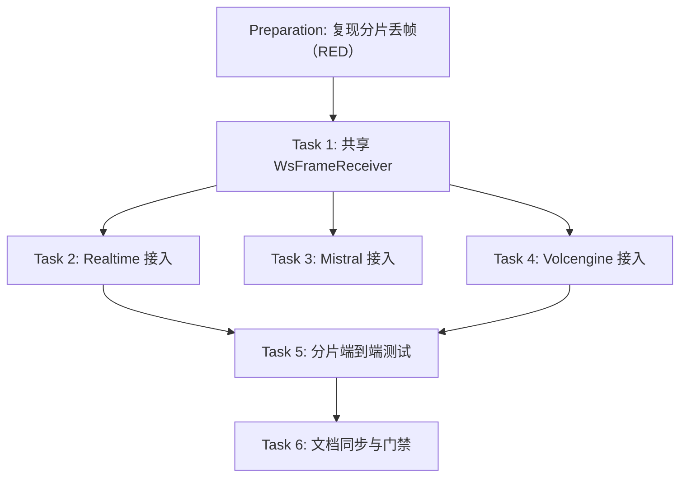

# Preparation

## Parallel Execution Strategy

- **Sequential Baseline**: 先在未修复代码上复现「分片投递 → partial 长度为 0」，确认 RED。
- **Parallel Slices**: Task 2/3/4 是三个独立后端的接入点，均依赖 Task 1 的接口。
- **Convergence & Verification**: Task 5 用真实会话 + 假 WS 服务端覆盖两类帧，Task 6 同步当前态文档并通过 cabbage 门禁。

- [x] 复现：假服务端按 4KB×6 写出 24KB delta 帧，修复前 `max partial len=0`（issue #41 原始复现），修复后 `24000`。

# Tasks

## Task 1: 共享接收器（ws_frame_receiver.h）
- **Builds**: 一个跨调用保留前缀的消息级重组状态机，含超限跳过与边界复位。
- **Blocked By**: None
- **Parallel Group**: Group 1
- **Verification**: `ctest -R ws_frame_reassembly_test`
- [x] 新增 `src/addon/asr/utils/ws_frame_receiver.h`：`WsFrameReceiver`（Idle/Collecting/Ignoring/Discarding 状态机）+ `ReceiveWsMessage()`（connect-only 收包循环，保留 curl 版本分支）。
- [x] 状态机不变量：`Again` 不清缓冲；结束判据 `bytesleft == 0 && !(flags & CURLWS_CONT)`；超限整条丢弃后回 `Idle`。

## Task 2: Realtime 接入
- **Builds**: `RealtimeAsrSession` 能完整重组跨 TCP 分片的事件。
- **Blocked By**: Task 1
- **Parallel Group**: Group 2
- **Verification**: `ctest -R ws_frame_reassembly_test`
- [x] 删除局部 `ReceiveTextFrame` 与 `RecvStatus`，改为会话级 `WsFrameReceiver receiver(CURLWS_TEXT)` + `ReceiveWsMessage`；`Skipped` 走 `continue` 重新读取。
- [x] 保留 `kLogTag` 作为日志前缀，错误与超限日志文案与既有风格一致。

## Task 3: Mistral 接入
- **Builds**: `MistralAsrSession` 同上。
- **Blocked By**: Task 1
- **Parallel Group**: Group 2
- **Verification**: 构建 + `ctest`（共享实现由 T-1~T-8 覆盖）
- [x] 同一改法（TEXT 接收），删除局部实现。

## Task 4: Volcengine 接入
- **Builds**: `VolcengineAsrSession` 能完整重组跨 TCP 分片的二进制响应帧。
- **Blocked By**: Task 1
- **Parallel Group**: Group 2
- **Verification**: `ctest -R ws_frame_reassembly_test`
- [x] 删除局部 `ReceiveWebSocketFrame`，改为 `WsFrameReceiver receiver(CURLWS_BINARY)`；`RecvStatus` 增加 `Skipped` 并由调用方 `continue`。

## Task 5: 分片端到端与单元测试
- **Builds**: 可重复运行的回归测试，覆盖 issue #41 的三条验收标准。
- **Blocked By**: Task 2, Task 4
- **Parallel Group**: Group 3
- **Verification**: `ctest --test-dir build --output-on-failure`
- [x] 新增 `tests/ws_frame_reassembly_test.cpp`：8 个接收器单测 + 1 个真实 socket 集成用例 + 2 个真实会话端到端用例（Realtime TEXT / Volcengine BINARY）。
- [x] 注册到 `tests/CMakeLists.txt`（含 Link `ZLIB::ZLIB`），补全 curl/fcitx5/jsoncpp 链接。
- [x] RED 验证：在未修复的 `realtime_asr.cpp`/`volcengine_asr.cpp` 上运行同一测试，T-3/T-9/T-10 失败（`max partial len=0`）。

- [x] 既有 6 个测试无回归：`ctest` 7/7 通过。
- [x] 更新 `docs/03-architecture/system-design/ARCHITECTURE.md` 中流式 WS 后端与错误处理策略的当前态描述。

# Verification

- [x] `cmake -B build -DCMAKE_BUILD_TYPE=Release -DBUILD_TESTS=ON && cmake --build build -j$(nproc)`：构建通过。
- [x] `ctest --test-dir build --output-on-failure`：7/7 通过（含新增 `ws_frame_reassembly_test`）。
- [x] 修复前对照（RED）：`git stash` 三个后端改动后重建测试，`realtime split-delta: max partial len=0`、`volcengine split-binary: max partial len=0`；恢复后为 `24000`/`24000`。
- [x] `cabbage validate ws-frame-reassembly` 与 `cabbage gate ws-frame-reassembly merge` 通过。
- [x] 回滚就绪性：本变更无持久化状态、无配置项、无外部契约变化，revert 即为回滚。
