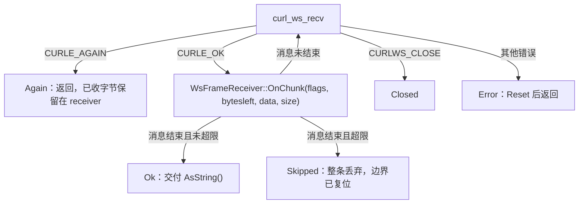

# Context

## Current State

三个流式 WS 后端各自在 `.cpp` 的匿名 namespace 里实现了「读一条消息」的函数，形态完全一致：

```cpp
// 修复前（realtime_asr.cpp / mistral_asr.cpp）
RecvStatus ReceiveTextFrame(CURL* curl, std::string& out) {
    out.clear();                      // ← 每次调用都清空，前缀随之丢失
    ...
    if (result == CURLE_AGAIN) return RecvStatus::Again;   // ← 已收字节被丢弃
    ...
}
```

`curl_ws_recv` 的语义是「本次调用能取多少取多少」：当一条消息的 payload 只到达了一部分时，libcurl 先返回这部分数据，下次调用在 socket 暂无数据时返回 `CURLE_AGAIN`。由于缓冲是函数局部变量，返回 `Again` 就等于把已收前缀丢掉；下一次调用拿到的是同一消息的后半段，`Json::Reader::parse()` 失败后被 `continue` 静默跳过。火山引擎后端同理（二进制帧），只是类型过滤用 `CURLWS_BINARY`。

已实测复现（详见 issue #41）：服务端完整写出 24071 字节的 Realtime delta 帧并分 6 次 4KB 写出，客户端 14s 内最大 partial 长度为 0。本变更用同一手法复现并按优先级验证（见 `test-plan.md`）。

## Goals and Non-goals

- Goal: 单条服务端事件跨 TCP 分片（含 WS `CURLWS_CONT` 分片）时能被完整重组，前缀不丢。
- Goal: 超限消息整条丢弃，且不破坏后续消息的解析边界（issue #41 验收标准 3）。
- Goal: 三处同构实现收敛为一份共享实现，避免同类缺陷再次分头出现。
- Non-goal: 不改动发送路径（发送无截止时间属于 issue #42，另行修复）。
- Non-goal: 不改动会话终态判定与保序缓冲（分别属于 issue #44 / #43）。
- Non-goal: 不引入 `CURLOPT_WRITEFUNCTION` 回调式收发（当前 connect-only 架构下改动面过大）。

# Requirements

| ID | Technical requirement | Source |
|---|---|---|
| TR-1 | 接收缓冲跨 `CURLE_AGAIN` 保留，仅在消息结束或显式复位时清空 | issue #41 根因 |
| TR-2 | 单条消息累计超过上限时整条丢弃，并在消息边界恢复解析 | issue #41 验收标准 3 |
| TR-3 | 非目标类型的帧不得污染目标消息内容或边界 | 现有 `isText` / `CURLWS_BINARY` 过滤语义 |
| TR-4 | 三个后端（Realtime / Mistral / Volcengine）共用同一接收实现 | issue #41「三处同构修改，建议同时抽出公共 helper」 |
| TR-5 | 超限丢弃不得被当作传输故障（不触发重连） | 保持原有「限制单帧累计大小」的防护意图 |

# Design

## Overview

新增 `src/addon/asr/utils/ws_frame_receiver.h`（仅头文件，随 addon 源一起编译），导出两个组件：

1. `WsFrameReceiver`：消息级重组状态机。状态 `Idle → Collecting / Ignoring / Discarding`，调用方每次 `curl_ws_recv` 成功后在循环里喂入 `(flags, bytesleft, data, size)`，直到拿到 `Ok`（完整消息）/ `Skipped`（整条超限丢弃）/ `Again`（暂无更多数据，已收字节保留）/ `Closed` / `Error`。
2. `ReceiveWsMessage(curl, receiver, logTag, errorOut)`：connect-only 连接上的收包循环，内部处理 `CURLE_AGAIN`（返回 `Again`，不清缓冲）、`CURLE_OK`（喂给 receiver）、错误（`receiver.OnTransportError()` 后返回 `Error`），保留原有 curl 版本分支以兼容 curl < 8.2 的非 const `metap` 签名。

三个后端删除各自的 `ReceiveTextFrame` / `ReceiveWebSocketFrame` 与局部 `RecvStatus` 枚举，改为持有会话级 `WsFrameReceiver`（Realtime/Mistral 为 `CURLWS_TEXT`，Volcengine 为 `CURLWS_BINARY`）并调用 `ReceiveWsMessage`。



## Interfaces and Data

```cpp
class WsFrameReceiver {
public:
    enum class Status { Ok, Again, Skipped, Closed, Error };
    static constexpr size_t kDefaultMaxMessageBytes = 16 * 1024 * 1024;

    explicit WsFrameReceiver(int targetFlags = CURLWS_TEXT,
                             size_t maxMessageBytes = kDefaultMaxMessageBytes);

    Status OnChunk(int flags, curl_off_t bytesleft, const uint8_t* data, size_t size);
    Status OnTransportError();          // Reset + Error
    const std::vector<uint8_t>& Bytes() const;
    std::string AsString() const;
    size_t MaxMessageBytes() const;
    void Reset();
    bool Dropping() const;
};

enum class WsMessageStatus { Ok, Again, Skipped, Closed, Error };
WsMessageStatus ReceiveWsMessage(CURL* curl, WsFrameReceiver& receiver,
                                 const char* logTag, CURLcode* errorOut = nullptr);
```

**状态不变量**

- 缓冲仅在「开始采集一条新消息」或 `Reset()` 时清空；`Again` 不清空也不改动已收字节（TR-1）。
- 一条消息的结束判据为 `bytesleft == 0 && !(flags & CURLWS_CONT)`——仅当既无剩余 payload、又不是 WS 分片续帧时才算结束。
- 超出 `maxMessageBytes` 时置 `Discarding` 并在消息结束时返回一次 `Skipped`，缓冲清空、状态回 `Idle`（TR-2、TR-5）。
- 非目标类型片段进入 `Ignoring`，其字节不写入缓冲；目标消息仍从 `offset == 0` 的片段开始采集（TR-3）。
- `CURLWS_CLOSE` 与传输错误都会 `Reset()`，避免半条消息残留污染重连后的新会话（TR-1）。
- `ReceiveWsMessage` 保留 curl 版本分支（`LIBCURL_VERSION_NUM >= 0x080200` 时 `metap` 为 const），与仓库既有写法一致。

**字段选取说明**：`curl_ws_frame` 的 `flags` 同时携带类型位（TEXT/BINARY）、`CURLWS_CONT`（分片续帧）与 `CURLWS_CLOSE`；`bytesleft` 为当前帧剩余 payload 字节数。分片消息的每个 fragment 都带类型位，因此「是否属于本接收器」可在每个片段上独立判断，无需跨调用记忆。`age` / `offset` 语义在旧版 curl 上不保证，故实现不依赖它们。

# Alternatives

| Option | Benefits | Costs and risks | Decision |
|---|---|---|---|
| 现状（局部缓冲 + `Again` 丢弃） | 零改动 | 大帧整条丢失，preedit 缺字、终态判定失败后走 30s 兜底 | 拒绝：issue #41 已实测复现 |
| 把缓冲提升为各后端会话成员变量（issue 建议的最小改动） | 改动局部，三处各改一次 | 三份同构状态机继续漂移；边界/超限逻辑重复 | 拒绝：未消除重复根因 |
| 共享 `WsFrameReceiver`（本变更） | 一份实现、一份测试；边界与超限语义统一 | 新增一个头文件与三处调用点改写 | 采纳 |
| 改用 `CURLOPT_WRITEFUNCTION` 回调式接收 | 交给 libcurl 处理分片 | 需从 connect-only 迁移到传输模式，改动会话生命周期与取消路径，超出 bugfix 范围 | 拒绝：成本/风险不匹配 |
| 按 `age`/`offset` 判断新消息 | 语义更直接 | 旧版 curl（Debian 12 的 7.88）字段语义不保证 | 拒绝：改用 `bytesleft + CURLWS_CONT` |

# Security and Privacy

无新增信任边界：仍是从既有 TLS/WS 连接读取服务端数据。保留并统一了 16MB 单消息上限以防异常服务端耗尽内存；超限走 `Skipped` 而非 `Error`，避免异常数据被放大为「断开重连」的行为。日志只打印长度与上限，不打印转写内容。

# Observability

| Signal | Purpose | Alert or dashboard |
|---|---|---|
| `FCITX_ERROR` "<tag> WS message exceeds N bytes, dropped" | 证明服务端返回了超限消息且被整条丢弃，并附带实际上限 | 常规日志观察；重复出现说明上游异常或上限过小 |
| `FCITX_ERROR` "<tag> curl_ws_recv failed: <curl_easy_strerror>" | 证明底层传输错误（非分片） | 与既有重连告警一起观察 |
| `FCITX_INFO` "WS connected session=N" | 证明会话建立，作为分片问题的观察起点 | 既有日志 |

# Failure Modes

| Failure mode | Detection | Handling | Recovery |
|---|---|---|---|
| 分片消息中途切换 TEXT/BINARY（协议违规） | 无直接信号；`Collecting` 中收到非目标片段 | 丢弃已收集内容，转入 `Ignoring` 并在边界复位 | 下一条消息从 `Idle` 重新采集 |
| 服务端持续发送超限消息 | 重复的 "exceeds ... dropped" 错误日志 | 每条整条丢弃，不影响后续消息 | 无需人工干预；若持续出现需排查上游 |
| 读期间连接被对端关闭 | `CURLE_OK` 且 `flags & CURLWS_CLOSE`，或 `curl_ws_recv` 返回错误 | 返回 `Closed` / `Error`，`Reset()` 清半条消息 | 由既有重连逻辑建新连接（本变更不改） |
| 取消会话时正在收半条消息 | `state_->cancelled` 由调用方循环检查 | 既有的 `Cancel()` 路径退出，receiver 随会话析构释放 | 无需人工干预 |

# Rollout

单个 PR 交付，无开关、无配置变更、无数据迁移。顺序：共享接收器 → 三处调用点改写 → 单元与端到端测试 → 文档同步。成功判据：`ctest` 中 `ws_frame_reassembly_test` 通过（分片事件完整重组，超限整条丢弃且边界恢复），其余既有测试不回归。

# Rollback

回滚方式为 revert 本 PR：三处调用点恢复各自的局部缓冲实现，`ws_frame_receiver.h` 与对应测试一并移除。无持久化状态、无外部契约变化，回滚无数据安全约束。

# Open Questions

- N/A（修复范围与验收标准已在 issue #41 中确定，无待决技术选项）
