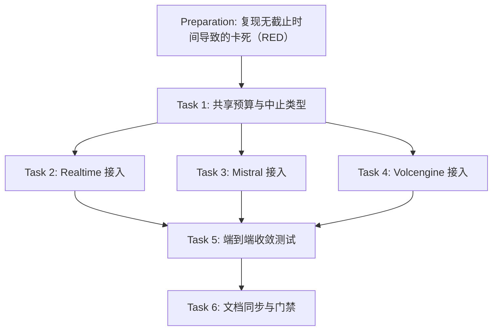

# Preparation

## Parallel Execution Strategy

- **Sequential Baseline**: 先用「握手后不读 socket」的假服务端确认现状卡死（突变验证：去掉截止时间后测试 400s 未退出）。
- **Parallel Slices**: Task 2/3/4 是三个后端的接入点，均依赖 Task 1 的共享类型。
- **Convergence & Verification**: Task 5 用真实会话覆盖三个后端的 End 收敛，Task 6 同步当前态文档并通过门禁。

- [x] 突变验证（RED）：把 `SendWsMessage` 的 `deadline.Expired()` 分支短路并去掉 End 后跳过重连，`ws_send_budget_test` 运行 400s 未退出（挂死），证明测试能捕获「无截止时间」缺陷；恢复后全部通过。

# Tasks

## Task 1: 共享预算与中止类型（ws_deadline.h / ws_frame_sender.h）
- **Builds**: 单次发送预算、End 路径总预算、统一中止条件与 connect-only 建连中止适配。
- **Blocked By**: None
- **Parallel Group**: Group 1
- **Verification**: `ctest -R ws_send_budget_test`
- [x] 新增 `src/addon/asr/utils/ws_deadline.h`：`WsDeadline`（按值复制共享截止时刻）、`WsEndBudget`（原子、`Arm()` 幂等）、`WsAbort`（`cancelled`/`finished` 双条件 + `CancelOnly`/`CancelOrFinished`）、`WsAbortProgressCallback`（`CURLOPT_XFERINFOFUNCTION` 适配）。
- [x] 新增 `src/addon/asr/utils/ws_frame_sender.h`：`SendWsMessage`（TEXT/BINARY 重载），`CURLE_AGAIN` 与零进展时检查预算，到期打印含待发字节数的错误日志。
- [x] 拆分为两个头文件：`ws_deadline.h` 不依赖 fcitx-utils（便于测试与单测直接包含），`ws_frame_sender.h` 依赖日志。

## Task 2: Realtime 接入
- **Builds**: 单次发送有界失败；End 路径总时长有界；End 后不再重连；建连响应 finished。
- **Blocked By**: Task 1
- **Parallel Group**: Group 2
- **Verification**: `ctest -R ws_send_budget_test`
- [x] 删除局部 `SendWebSocketText` 与 `CancelProgressCallback`，改为调用 `SendWsMessage`。
- [x] `End()` 中 `endBudget_.Arm()`（在置位 `finished` 之前武装，保证 worker 读到已生效的预算）。
- [x] End 的 flush/commit 使用 `CancelOnly` + 共享的 `endBudget_.Deadline()`；等待终态循环改用 `endBudget_.Expired()`；推流 append/commit/30min commit 与建连使用 `CancelOrFinished`。
- [x] 重连前检查 `finished || endBudget_.Expired()`：不再重连，直接 `publishFinal(fullTranscript)` 兜底终态。

## Task 3: Mistral 接入
- **Builds**: 同 Task 2（Mistral 特有事件名与 1s 重连退避）。
- **Blocked By**: Task 1
- **Parallel Group**: Group 2
- **Verification**: `ctest -R ws_send_budget_test`
- [x] 同一改法：`End()` 武装预算；flush/end 用 `CancelOnly`；周期 flush/append/30min flush 与建连用 `CancelOrFinished`；End 等待改由 `endBudget_.Expired()` 控制。
- [x] End 后不重连时，若尚未发送 end 事件则上报一次兜底 final，随后退出。

## Task 4: Volcengine 接入
- **Builds**: 单次发送有界失败；End 路径（结束帧 + 等待终态）总时长有界；建连响应 finished。
- **Blocked By**: Task 1
- **Parallel Group**: Group 2
- **Verification**: `ctest -R ws_send_budget_test`
- [x] 删除局部 `SendWebSocketBinary` 与 `CancelProgressCallback`，改为调用 `SendWsMessage`。
- [x] `End()` 武装预算；结束帧用 `CancelOnly`；音频推流与建连用 `CancelOrFinished`；End 等待循环由原先固定的 30s 改为 `endBudget.Expired()`（该后端无重连路径）。

## Task 5: 端到端收敛测试
- **Builds**: 可重复运行的回归测试，覆盖 issue #42 的三条验收标准。
- **Blocked By**: Task 2, Task 3, Task 4
- **Parallel Group**: Group 3
- **Verification**: `ctest --test-dir build --output-on-failure`
- [x] 新增 `tests/ws_send_budget_test.cpp`：`NonReadingWsServer`（握手后不读 socket + `SO_RCVBUF=4096`）、单次预算用例、取消优先用例、三个后端的 `CheckEndConverges` 公共断言（14s 内结束 + 产出终态 + 可回收）。
- [x] 注册到 `tests/CMakeLists.txt`（链接 Realtime/Mistral/Volcengine 源文件与 `ZLIB::ZLIB`）。
- [x] 为 `ws_send_budget_test`（90s）与 `ws_frame_reassembly_test`（120s）设置 `ctest` `TIMEOUT`：缺陷回归时表现为超时失败而非挂起。

- [x] 既有 7 个测试无回归：`ctest` 8/8 通过。
- [x] 更新 `docs/03-architecture/system-design/ARCHITECTURE.md` 与 `docs/08-testing/README.md`。

# Verification

- [x] `cmake -B build -DCMAKE_BUILD_TYPE=Release -DBUILD_TESTS=ON && cmake --build build -j$(nproc)`：构建通过。
- [x] `ctest --test-dir build --output-on-failure`：8/8 通过。
- [x] 单次预算证据：预算 1500ms，实测 `sent=0 elapsed=1506ms`（≤6000ms 断言内）。
- [x] End 收敛证据（上游不读 socket）：Realtime `end->done=3ms`、Mistral `end->done=3ms`、Volcengine `end->done=8034ms`（End 预算 8s），三者均在 14s 内结束并产出 final，`JoinWithTimeout(2s)` 未超时。
- [x] 突变验证：去掉截止时间与 End 跳过重连后测试挂死（400s 未退出），恢复后 8/8 通过。
- [x] `cabbage validate ws-send-deadline` 与 `cabbage gate ws-send-deadline merge` 通过。
- [x] 回滚就绪性：无持久化状态、无配置项、无外部契约变化，revert 即为回滚。
