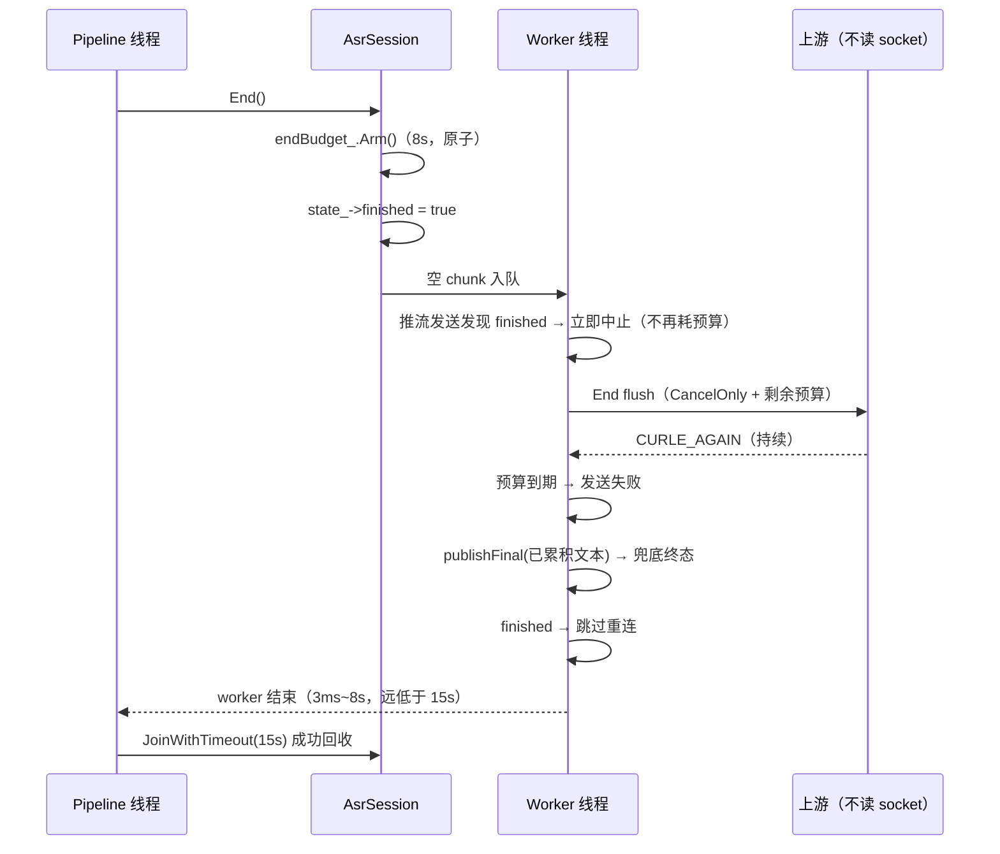

# Context

## Current State

三个流式 WS 后端的发送实现同构，且都没有截止时间：

```cpp
// 修复前（realtime_asr.cpp / mistral_asr.cpp / volcengine_asr.cpp）
bool SendWebSocketText(CURL* curl, const std::string& data,
                       const std::atomic<bool>& cancelFlag) {
    size_t remaining = data.size();
    const char* ptr = data.data();
    while (remaining > 0) {
        if (cancelFlag.load()) return false;          // 只检查 cancelled
        size_t sent = 0;
        CURLcode result = curl_ws_send(curl, ptr, remaining, &sent, 0, CURLWS_TEXT);
        if (result == CURLE_AGAIN) { std::this_thread::sleep_for(10ms); continue; }  // 无限重试
        ...
    }
    return true;
}
```

libcurl 的 `CURLOPT_TIMEOUT` 只约束传输阶段；`CONNECT_ONLY=2` 建连之后的 `curl_ws_send` / `curl_ws_recv` 不受其约束。issue #42 实测：对端不读 socket 时 8MB 单帧在 8s 内重试 788 次、**1 字节未发出**。因此：

1. 推流中的 append/flush 会长时间阻塞 worker；
2. `End()` 只置 `finished`、不置 `cancelled`，发送循环看不到它，End 路径的 flush/commit 一旦卡住就永远出不来；
3. worker 在 `SessionReaper::JoinWithTimeout(15s)`（`session_reaper.cpp:39`）超时后被 detach → 线程与会话泄漏；
4. 该会话永不产生终态 → `OrderedResultBuffer` 的 `nextUtteranceId_` 停在它上面 → 后续所有语音段结果被扣住（级联问题见 issue #43）。

`End()` 之后还会重连：发送失败把 `reconnectNeeded` 置位，连接循环继续下一轮（最多 3 次），每轮又各耗一次发送/建连时间，累计可远超 15s，**即使单次发送有预算也仍会被 detach**。这是本设计必须一并处理的放大路径。

## Goals and Non-goals

- Goal: 单次发送在预算内失败，不再无限重试（issue #42 验收 1 的基础）。
- Goal: `End()` 后整条收尾路径（flush → commit/end → 等待终态 → 可能的重连）在 End 预算内收敛，使 `JoinWithTimeout(15s)` 不再超时（验收 2）。
- Goal: 任何发送失败都交出终态（兜底 final），使保序闸门不被无终态会话卡住（验收 3）。
- Non-goal: 不改接收路径（分片重组属于 issue #41，已在 PR #45 修复）。
- Non-goal: 不改保序缓冲的跳过策略（属 issue #43）。
- Non-goal: 不改 30s 终态等待与 `commitsInFlight` 判定（属 issue #44）；本变更只把「End 等待窗口」与 End 总预算对齐。
- Non-goal: 不引入半死连接的空闲检测（issue #42 的可选项，非验收要求）。

# Requirements

| ID | Technical requirement | Source |
|---|---|---|
| TR-1 | 单次发送受 wall-clock 预算约束，超时按发送失败返回 | issue #42 修复方向 1 |
| TR-2 | End 路径的总耗时（含 flush/commit/等待/重连）有上界，明显小于 reaper 的 15s | issue #42 验收 2 |
| TR-3 | End 之后不再重连（重连只会再阻塞一轮且无音频可发） | issue #42 修复方向 2 的延伸 |
| TR-4 | 发送失败/卡死路径必须产出终态（兜底 final），不留下无终态会话 | issue #42 验收 3 |
| TR-5 | 取消优先：`Cancel()` 置位后发送立即中止 | 既有语义 |
| TR-6 | 三处发送实现收敛为共享实现 | 与 issue #41 的收敛策略一致 |

# Design

## Overview

`src/addon/asr/utils/ws_deadline.h`（无 fcitx-log 依赖，可被测试单独包含）提供三个协作类型：

1. `WsDeadline`：**单次操作预算**。按值复制共享同一截止时刻，复制不重置计时，因此可把「一次逻辑操作」的多步发送绑到同一份预算（End 的 flush + commit）。
2. `WsEndBudget`：**End 路径总预算**（默认 8s，远小于 reaper 的 15s）。`End()` 在 pipeline 线程武装它，worker 线程读取，故内部用 `std::atomic`。`Deadline()` 返回按剩余时间收缩的 `WsDeadline`；未武装时返回全新默认预算（正常推流路径不受影响）。
3. `WsAbort`：**中止条件**。`cancelled` 在任何路径生效；`finished` 只用于非 End 路径（推流 append/flush/30min commit 与 WS 建连）——End 自身的 flush/commit 仍需在 `finished` 置位后发送，故那些调用传 `CancelOnly`。同时提供 `WsAbortProgressCallback` 作为 `CURLOPT_XFERINFOFUNCTION` 适配器，使 **connect-only 的建连阶段**也受同一条件约束（旧实现只把 `cancelled` 接到该回调）。

`src/addon/asr/utils/ws_frame_sender.h` 提供 `SendWsMessage`（TEXT/BINARY 两个重载），在每次循环检查 `abort.Requested()`，`CURLE_AGAIN` 或「零进展」时检查 `deadline.Expired()`，到期即失败并打印含待发字节数的错误日志。



## Interfaces and Data

```cpp
class WsDeadline {
public:
    static constexpr std::chrono::milliseconds kDefaultBudget{10000};
    explicit WsDeadline(std::chrono::milliseconds budget = kDefaultBudget);
    bool Expired() const;
    std::chrono::milliseconds Remaining() const;
    std::chrono::milliseconds Budget() const;   // 仅用于日志
};

class WsEndBudget {
public:
    static constexpr std::chrono::milliseconds kDefaultTotal{8000};
    void Arm(std::chrono::milliseconds total = kDefaultTotal);  // 幂等，不重置
    bool Armed() const;
    bool Expired() const;
    std::chrono::milliseconds Remaining() const;
    std::chrono::milliseconds Total() const;
    WsDeadline Deadline() const;
};

struct WsAbort {
    const std::atomic<bool>* cancelled = nullptr;
    const std::atomic<bool>* finished = nullptr;
    bool Requested() const;
    static WsAbort CancelOnly(const std::atomic<bool>& cancelled);
    static WsAbort CancelOrFinished(const std::atomic<bool>& cancelled,
                                    const std::atomic<bool>& finished);
};

int WsAbortProgressCallback(void* clientp, curl_off_t, curl_off_t, curl_off_t, curl_off_t);
bool SendWsMessage(CURL*, const uint8_t*, size_t, unsigned int,
                   const WsAbort&, const char* logTag, WsDeadline = {});
bool SendWsMessage(CURL*, const std::string&, unsigned int,
                   const WsAbort&, const char* logTag, WsDeadline = {});
```

**各调用点使用的中止条件与预算**

| 调用点 | 中止条件 | 预算 |
|---|---|---|
| `session.update` / 请求帧（握手后首帧） | `CancelOrFinished` | 默认（未武装时为 10s 单次） |
| 推流 append / 周期 commit / 周期 flush | `CancelOrFinished` | 默认单次预算 |
| 30min 强制 commit/flush | `CancelOrFinished` | 默认单次预算 |
| End 尾部 flush + commit/end | `CancelOnly`（End 必须能发） | `endBudget_.Deadline()`（共享剩余时间） |
| End 等待终态循环 | —（`endBudget_.Expired()` 控制） | `endBudget_` |
| End 后的重连 | `finished || endBudget_.Expired()` 时**不重连** | `endBudget_` |
| WS 建连 (`curl_easy_perform`) | `CancelOrFinished`（经 progress callback） | `CONNECTTIMEOUT`(10s) + 上述中止 |

**不变量**

- 单次发送预算与 End 总预算是独立维度：前者限「一次发送」，后者限「整条收尾路径」。End 预算按剩余时间收缩后传给发送，因此多次发送不会各自重置计时。
- `Arm()` 幂等：`End()` 可能重复调用（协议上 pipeline 只调一次，但重复调用不会延长已设定的截止时刻）。
- 中止优先于预算：`Requested()` 在每次 `curl_ws_send` 前检查，置位后最多再等一次 10ms 退避。
- 未武装 End 预算时（正常推流阶段）行为与旧的单次预算一致，不引入额外延迟。

# Alternatives

| Option | Benefits | Costs and risks | Decision |
|---|---|---|---|
| 现状（无截止时间） | 零改动 | 上游不读 socket 时永久卡死 + 线程泄漏 + 保序闸门被扣住 | 拒绝：issue #42 已实测 |
| 只给单次发送加预算（issue 建议的最小改动） | 改动小 | End 后仍会「失败 → 重连 → 再失败」，3 轮可超过 15s，仍被 detach | 拒绝：实测该路径（`end->done=14000ms`） |
| 仅依赖 `CURLOPT_TIMEOUT` / `CURLOPT_LOW_SPEED_LIMIT` | 无需手写循环 | 对 connect-only 之后的 WS 收发不生效（issue #42 已实测） | 拒绝 |
| `WsDeadline` + `WsEndBudget` + `WsAbort`（本设计） | 单次与整条路径分别有界；建连与推流也受约束 | 需区分两处预算语义，实现稍复杂 | 采纳 |
| 用独立线程做 watchdog 强制 `Cancel()` | 不侵入发送循环 | 引入线程与竞态，且 End 语义仍不清晰 | 拒绝：复杂度不匹配 |
| 为半死连接增加空闲检测（N 秒无事件判定失效） | 更早发现半死连接 | 非验收要求，需区分「上游静默」与「上游慢」 | 暂不做（记入 Open Questions） |

# Security and Privacy

无新增信任边界：仍是既有 TLS/WS 连接上的发送路径。错误日志只打印待发字节数、预算与 libcurl 错误串，不打印转写内容（与既有约定一致）。预算上限同时起到「恶意/异常上游拖住本地线程」的缓解作用。

# Observability

| Signal | Purpose | Alert or dashboard |
|---|---|---|
| `FCITX_ERROR` "`<tag>` WS send timeout after Nms (M bytes pending): peer is not reading" | 证明发送被预算截断且上游未读 | 常规日志观察；与「End reached, skipping reconnect」同时出现即命中 issue #42 场景 |
| `FCITX_ERROR` "`<tag>` WS send stalled (M bytes pending)" | 证明 `curl_ws_send` 未报错但零进展 | 同上 |
| `FCITX_WARN` "`<tag>` End reached, skipping reconnect session=N" | 证明 End 后拒绝重连（避免再阻塞一轮） | 观察 End 收敛路径 |
| `FCITX_WARN` "`<tag>` End wait timeout session=N" | 证明 End 预算耗尽仍未收到终态，已兜底 final | 观察上游响应慢的情况 |

# Failure Modes

| Failure mode | Detection | Handling | Recovery |
|---|---|---|---|
| 上游完全停止读取 socket | 发送超时错误 + 待发字节数 | 单次发送在预算内失败；End 路径在 End 预算内兜底 final 并退出 | 下段语音新建会话；无需人工干预 |
| 发送失败后本应重连 | `End reached, skipping reconnect` | End 后不重连，直接兜底终态 | 下段语音首次连接即重建 |
| End 期间上游无终态响应 | `End wait timeout` | 以已累积文本兜底 final | 用户可见已识别内容；不再无限等待 |
| `Cancel()` 与 End 并发 | `Requested()` 命中 `cancelled` | 立即中止发送，走既有取消清理 | 无 |
| 建连阶段（`curl_easy_perform`）遇到 End | progress callback 返回 1 | `curl_easy_perform` 以 `CURLE_ABORTED_BY_CALLBACK` 结束，走 connect 失败分支 | 既有重连/兜底逻辑；End 时不再重试 |

# Rollout

单 PR 交付，无开关、无配置项、无数据迁移。顺序：共享预算/中止类型 → 三处发送与建连接入 → 端到端测试 → 文档同步。成功判据：`ws_send_budget_test` 通过（单次预算 1500ms 在 ~1505ms 返回；三个后端在上游不读时 End 后 3ms~8s 收敛且产出终态），其余测试不回归。

参数选择依据（相对 reaper 的 15s join）：
- End 总预算 8s：为「建连（≤10s CONNECTTIMEOUT，但 End 后不再重连）+ flush + commit + 等待」留出足够余量，同时确保 `JoinWithTimeout(15s)` 有 >7s 的安全边界。
- 单次发送预算 10s：正常上游下发送是毫秒级；10s 足以覆盖公网抖动，同时避免单次推流长时间占住 worker。

# Rollback

revert 本 PR 即回滚：三处恢复各自的局部发送函数与无预算重试，`ws_deadline.h` / `ws_frame_sender.h` 与对应测试移除。无持久化状态、无外部契约变化。回滚后 issue #42 的卡死与泄漏问题会复现，需同步降低 `SessionReaper` 期望或重新引入预算。

# Open Questions

- 是否补充「半死连接空闲检测」（N 秒无任何服务端事件 → 判定连接失效并提前重连）？属 issue #42 的可选项，非验收要求；当前预算已能保证有界收敛，故本变更不做。
- End 总预算的默认值（8s）是否应暴露为配置项？当前无用户诉求，且过小会牺牲慢速上游的完整性，先按常量固化并在 `WsEndBudget` 集中定义。
