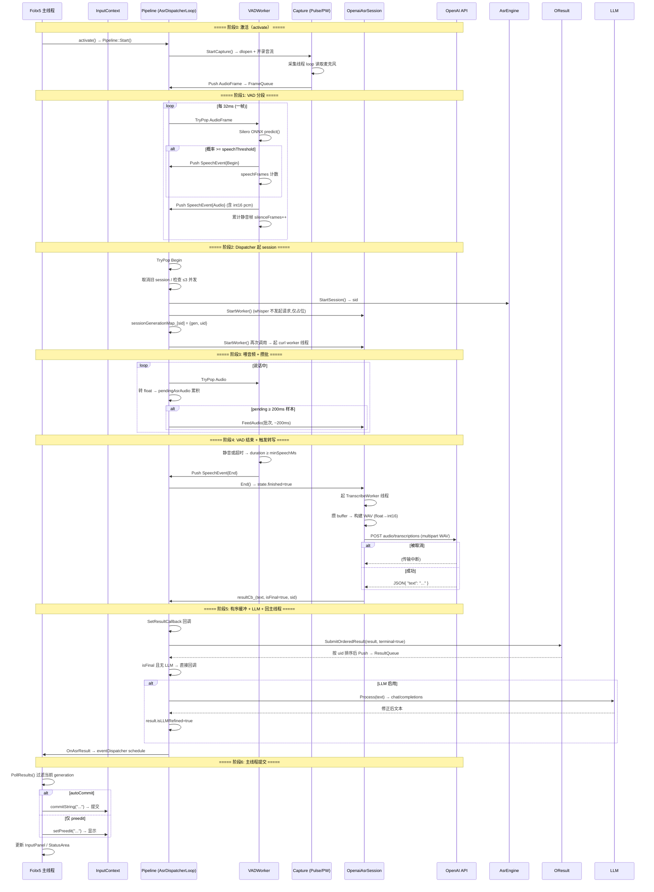
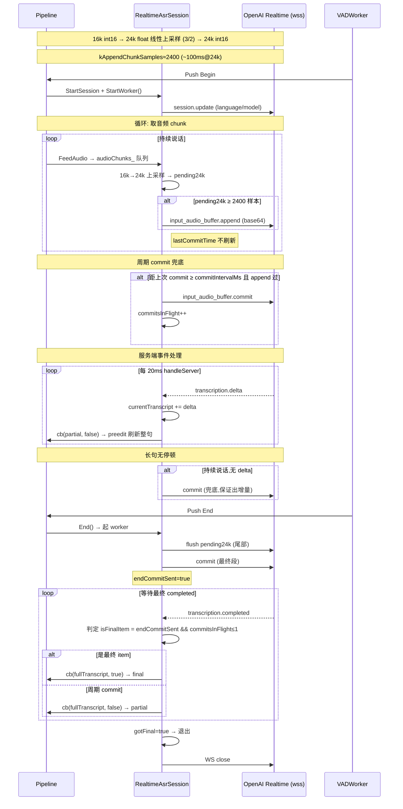
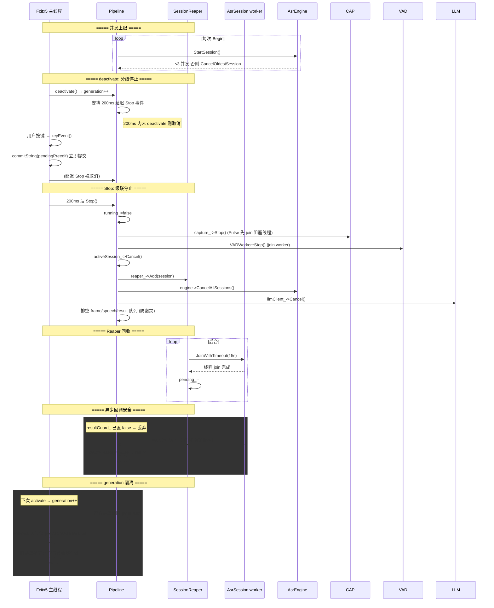

# fcitx5-voice-input 运行时调用序列

> **状态:** 与代码同步的实现文档。
> **关联:** [ARCHITECTURE.md](ARCHITECTURE.md)（总体架构）、[v4-asr-session-model.md](v4-asr-session-model.md)（会话模型）。
> **目的:** 把「录音 → VAD 分段 → ASR 转写 → LLM 后处理 → 提交文本」整条数据流，按线程与时间轴展开为可追溯的调用时序。

---

## 1. 一句话链路

```
录音 ─▶ FrameQueue ─▶ VAD(Silero) ─▶ SpeechEvent ─▶ ASR后端(OpenAI/Realtime/火山)
   │                                                                          │
   └───────────────────── AudioFrame ◀── DrainLoop ◀── on_process ◀── PipeWire ──┘
                                                                          ▼
                                              ResultQueue ─▶ 主线程 eventDispatcher ─▶ commit / preedit
```

一次用户说话，数据沿此链路单向流动；回传路径（ASR 结果 → 主线程）通过 `generation` 与 `utteranceId` 做隔离和排序。

---

## 2. 线程模型

| 线程 | 职责 | 关键约束 |
|---|---|---|
| **主线程** | Fcitx5 事件循环、`eventDispatcher`、`PollResults`、UI 更新 | 只做 UI 提交，绝不阻塞 |
| **VADWorker** | 消费 `FrameQueue`，跑 Silero ONNX，产出 `SpeechEvent` | 独立状态机（Idle/Speaking） |
| **AsrDispatcherLoop** | 消费 `SpeechEventQueue`，起/停 ASR session worker，跑 LLM | 唯一的 ASR 结果生成者 |
| **Session worker × N** | 每个活跃 session 一个 curl/WS 转写线程 | ≤3 并发（`kMaxActiveSessions`） |
| **SessionReaper** | 后台 `JoinWithTimeout(15s)` 回收 session worker | 可能晚于管线析构，靠 `resultGuard_` 检查 |
| **Capture thread** | Pulse: 1 个；PipeWire: `on_process` 回调线程 + `DrainLoop` 线程 | `on_process` ≤100μs 不阻塞 |

> 参考时序图 3 中的并发上限与回收逻辑。

---


## 3. 三种 ASR 模式的关键差异

| 维度 | OpenAI whisper | OpenAI Realtime | 火山引擎豆包 |
|---|---|---|---|
| 传输 | HTTP multipart WAV | WebSocket 流 | WebSocket 二进制帧(gzip) |
| 触发 | VAD End 后一次性转写 | 建立持久会话，流式 append | 同上，流式 |
| preedit | 无（整句 final） | delta 实时刷新 | utterances 增量 |
| 重连 | 无 | 断线重连保 sessionId，30min 上限 | — |
| 并发单元 | 每句一个 session | 每句一个 session | 每句一个 session |

---

## 4. 详细时序图

### 4.1 单次语音段完整流程（OpenAI Whisper 模式）



### 4.2 Realtime 流式模式（长句实时）



### 4.3 会话生命周期 & 并发控制（deactivate / generation 隔离）



---

## 5. 关键数据流与并发保护点

| 环节 | 传递载体 | 关键并发保护 |
|---|---|---|
| 采集→VAD→Dispatcher | `FrameQueue` / `SpeechEventQueue`（mutex+cv） | SPSC 生产者-消费者 |
| Dispatcher→后端 | `engine->StartSession/FeedAudio/End/Cancel` | `engineMutex_` 保护 `sessions_` |
| 后端→Pipeline | `resultCb_(text,isFinal,sid)` | `SessionReaper` `JoinWithTimeout` |
| 乱序回调→主线程 | `OrderedResultBuffer`（按 `utteranceId`） | 排序保证 UI 顺序 |
| 异步回调 vs 析构 | `resultGuard_` + `sessionGenerationMap_` | 双重校验丢弃残留 |
| 跨会话切换 | `generation` 原子计数 | `PollResults` 过滤幽灵结果 |

### 5.1 generation 隔离详解

每次 `activate`/`deactivate` 都 `fetch_add` 递增 `generation`。所有 `AsrResult` 携带 `generation`，主线程 `PollResults()` 用 `activeGeneration_` 过滤。这样快速切换输入法时，上一个会话的在途回调（VAD 结束延迟、LLM 慢响应、Reaper 回收）全部被静默丢弃，不会污染当前输入。

### 5.2 异步回调安全

`SessionReaper` 可能晚于 `Pipeline` 析构退出（超时 15s）。其 `resultCb_` 回调前先检查 `resultGuard_`，若已置 `false` 则直接 return，避免访问已析构的 `Pipeline`（use-after-free）。

### 5.3 OrderedResultBuffer

并发 session 的回调可能乱序到达。`OrderedResultBuffer` 以 `utteranceId` 为 key 按序归并（partial 同段覆盖），仅在 `utteranceId == nextUtteranceId_` 时交付主线程，保证 UI 上屏顺序与语音段顺序一致。

---

## 6. 与 ARCHITECTURE.md 的关系

本文件聚焦**运行期调用时序**（谁在什么时刻调用谁），补充 ARCHITECTURE.md 的静态架构图，与 v4 会话模型文档互相印证。涉及的关键实现：

- 采集后端 dlopen 运行时加载、优雅降级 —— 见 capture 代码
- Silero VAD 状态机与 pre-roll —— 见 vad 代码
- 三种后端 WS/HTTP 协议细节 —— 见 asr 代码
- LLM 后处理（非流式 `Process` / 流式 `ProcessStream`）—— 见 llm_client 代码
