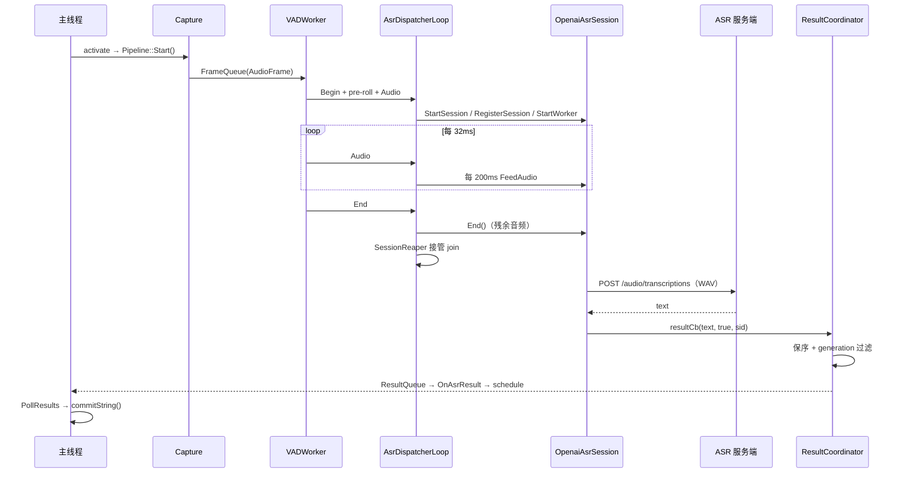
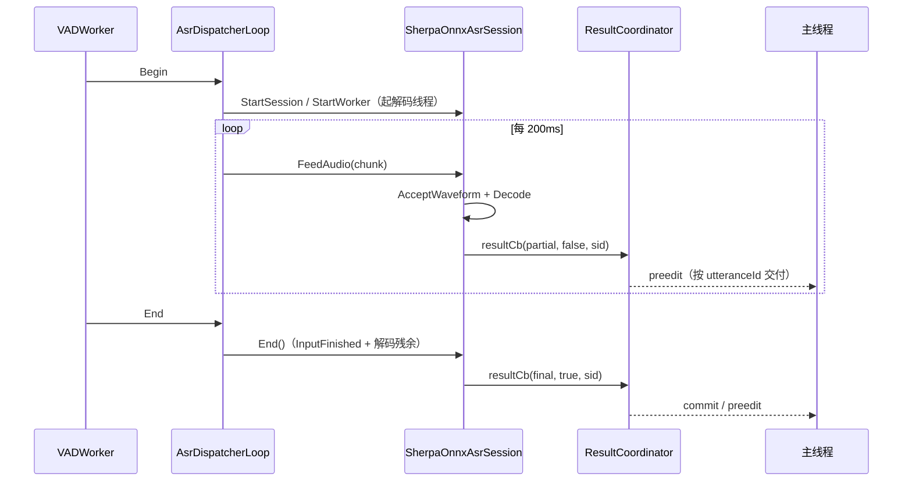

# fcitx5-voice-input 运行时调用序列

> **状态:** 当前实现文档（与 `src/addon/` 同步，含本地 Sherpa 后端与受控模型加载）。
> **关联:** [总体架构](index.md)、[组件详述](component-details.md)、[v4 会话模型](v4-asr-session-model.md)。
> **目的:** 把「录音 → VAD 分段 → ASR 转写 → LLM 后处理 → 提交文本」按线程与时间轴展开，便于排查时序问题。

---

## 1. 一句话链路

```
麦克风 ─▶ Capture ─▶ FrameQueue ─▶ VADWorker ─▶ SpeechEventQueue ─▶ AsrDispatcherLoop
                                                                        │
                                          ┌─────────────────────────────┘
                                          ▼
                              AsrSession worker ×N（云端 WS/HTTP 或本地 sherpa）
                                          │ resultCb(text, isFinal, sessionId)
                                          ▼
                          ResultCoordinator（generation 过滤 + 按 utteranceId 保序 + LLM）
                                          │ ResultQueue
                                          ▼
                    主线程 eventDispatcher ─▶ PollResults() ─▶ commitString() / preedit
```

两个标识贯穿全链路：

- `generation`：每次激活/停用递增。旧 generation 的结果在 `ResultCoordinator` 和主线程都会被丢弃。
- `utteranceId`：每段语音递增。并发会话的最终结果按它保序上屏。

本地模型加载不在识别链路内：首次激活或热切换时由后台准备线程完成，成功后才把引擎交给 pipeline。首次激活且尚无引擎时 pipeline 不启动；同一后端重载时旧引擎继续服务。

---

## 2. 线程与队列

| 线程 | 职责 | 关键约束 |
|---|---|---|
| **主线程** | Fcitx5 事件循环、`eventDispatcher`、`PollResults`、UI 更新 | 只做队列读取与上屏，禁止阻塞 |
| **Capture** | Pulse：1 个阻塞读线程（`pa_simple_read`）。PipeWire：`on_process` 回调 + `DrainLoop` 线程 | `on_process` ≤100μs，只写 ring buffer；取帧受 delivery gate 控制 |
| **VADWorker** | 消费 `FrameQueue`，跑 Silero ONNX，产出 `SpeechEvent` | 独立 Idle/Speaking 状态机 |
| **AsrDispatcherLoop** | 消费 `SpeechEventQueue`，起停会话、按 200ms 批量喂音频 | 唯一创建/回收会话的位置 |
| **AsrPrepare worker（0/1）** | 首次激活或热切换时在后台 `CreateAsrEngine()` + `Init()`（含本地模型校验与加载） | 最多一个；只持有配置快照与结果槽，不访问引擎/Pipeline/配置对象 |
| **Session worker × N** | 每个活跃会话一个后端线程（HTTP、WS 或本地解码） | 并发上限 3，超限取消最旧会话 |
| **SessionReaper** | 后台 `JoinWithTimeout(15s)` 回收会话线程 | 不阻塞分发线程与主线程 |
| **LLM** | 无独立线程：`Process`/`ProcessStream` 在会话 worker 内同步调用 | 30s 超时；按 generation 取消 |

| 队列 | 类型 | 容量 | 说明 |
|---|---|---|---|
| `frameQueue_` | `ThreadSafeQueue<AudioFrame>` | 1024 帧（≈32s） | 溢出丢最旧 |
| `speechEventQueue_` | `ThreadSafeQueue<SpeechEvent>` | 256 事件 | 溢出丢最旧 |
| `pendingAsrAudio_` | `std::vector<float>` | — | 分发线程内 200ms 批量缓冲 |
| `resultQueue_` | `ThreadSafeQueue<AsrResult>` | 无界 | 终态由 `ResultCoordinator` 保证不丢 |
| PipeWire ring buffer | lock-free SPSC | 秒级 | 仅音频回调线程写、`DrainLoop` 读 |
| 模型准备任务 | `AsrPrepareCoordinator::Job` | 最多 1 个在途 | 新请求替换“待执行”槽位；旧结果作废，主线程每 50ms 轮询取回 |

---

## 3. 阶段 0：激活（主线程）

```
activate(entry, event)
├── InitializeIfNeeded()            # 仅首次
│   ├── pipeline_->Init(config)     # VAD 参数
│   ├── ReloadAsrBackend("init")
│   │   ├── 云端：CreateAsrEngine() + engine->Init() 同步执行（不触网）
│   │   └── 本地：交给 AsrPrepareCoordinator 后台准备（见 3.1）
│   └── SetLLMClient(...)           # 启用且配置了模型时
├── activeIc_ / captureOwnerIc_ = watch()
├── generation = ++activeGeneration_
├── pipeline_->SetGeneration(generation)
└── pipeline_->Start()
    ├── 无引擎（本地模型仍在后台加载）→ 记录日志并返回，不打开录音
    └── 有引擎
        ├── 复用保留的 capture；不可用则重新 StartCapture()（Pulse → PipeWire fallback）
        ├── frameQueue_.Clear() / speechEventQueue_.Clear()
        ├── results_->Start(utteranceCounter_ + 1, generation)
        ├── vadWorker_->Start()         # 失败则 Stop() 回滚
        ├── asrThread_ = AsrDispatcherLoop
        └── capture_->SetDeliveryEnabled(true)
```

激活后的状态文字按实际结果选择：pipeline 正在运行 → 「语音输入就绪」；否则若 `asrPreparer_->IsPreparing()` → 「本地模型加载中...」；两者都不成立 → 「语音识别失败」。

`stage=engine.activate` 的 `init_ms` 只覆盖配置读取、后端快照与准备请求提交，**不含**本地模型加载；本地大模型不再让首次激活出现主线程停顿。

### 3.1 本地模型异步准备

```
主线程                                              AsrPrepare worker（最多 1 个）
ReloadAsrBackend(reason)
├── generation = ++asrPrepareGeneration_
├── snapshot = SnapshotActiveAsrBackend()           # 纯值快照
├── ResetInactiveLocalStatuses(snapshot.backend)
└── 本地后端：
    ├── installedBackend_ != backend → DropAsrEngine()
    │     └── SetAsrEngine(nullptr)：SkipAllSessions + CancelAllSessions +（仍在语音输入时）轮换 generation
    ├── UpdateModelStatus(State=loading, Detail=loading | reloading)
    └── asrPreparer_->Request(generation, snapshot) ──▶ CreateAsrEngine(snapshot)
                                                        ├── ResolveControlledSherpaModel(kind)
                                                        │   ├── 清单固定 id/version
                                                        │   └── 逐文件 SHA-256 + 字节数
                                                        ├── 校验失败 → nullptr + 状态码
                                                        └── 成功 → 缓存 AsrModelIdentity{id, version}

主线程 50ms 轮询定时器
└── ApplyPreparedAsrBackend(generation, engine, error)
    ├── generation 过期 / 已切回云端 → 丢弃（已加载引擎交独立线程析构）
    ├── 失败且无旧引擎 → DropAsrEngine + failed + 「语音识别失败」
    ├── 失败但同一后端重载 → 保留旧引擎 + failed + 「模型加载失败，继续使用原模型」
    └── 成功 → SetAsrEngine → installedBackend_ = backend → ready + 模型身份
        └── 仍在语音输入上下文且 pipeline 未运行 → pipeline_->Start()
```

约束：

- **单在途**：已有加载线程时，新请求只替换“待执行”槽位并作废旧结果；避免快速切换累积多个不可取消的模型加载线程。
- **取消不 join**：`Cancel()` 只标记放弃并继续轮询，直到工作线程自行结束；已加载的引擎在独立线程析构，避免主线程释放 ONNX session。
- **代次过滤**：只有最新 `asrPrepareGeneration_` 的结果能生效；切回云端会立即作废在途本地准备。
- 失焦/停用不会取消在途加载：模型仍会在后台准备完成并把状态更新为 `ready`；完成时若已不在语音输入上下文，不启动 pipeline（下次激活再按需 `Start()`）。

### 3.2 本地模型来源与安装

模型由独立的一次性进程 `voice-input-model-installer` 安装（由 fcitx5-configtool 的模型管理插件调用），addon 对模型目录只读：

- 只能使用编译期清单固定的模型：流式 `online-zipformer`、离线 `offline-x-asr`；不接受 `ModelDir` 或用户指定的模型文件路径，也不扫描目录。
- 落盘布局：`$XDG_DATA_HOME/fcitx5/voice-input/models/<id>/<version>/`，版本目录不可变；`install.json` 只是不可信 marker。
- addon 在调用 sherpa 前由 `ResolveControlledSherpaModel()` 逐文件校验 SHA-256 与字节数；从 `models` 起每级必须是真实目录（拒绝符号链接）。安装器另做归档摘要、白名单解包、子进程试加载与原子发布。
- 校验失败按 `NotInstalled` / `Tampered` / `Unreadable` / `DataDirUnavailable` / `InvalidSpec` 分类关闭本地识别，绝不把未验证文件交给 sherpa（错配会导致 `_Exit`/SIGSEGV）。

---

## 4. 阶段 1：采集与 VAD 分段

音频格式统一为 **16kHz mono / int16 / 512 samples（32ms）**。

```
Capture 线程
├── Pulse：pa_simple_read → AudioFrame → DeliverFrame(epoch)
└── PipeWire：on_process → ring buffer → DrainLoop → AudioFrame → DeliverFrame(epoch)
                                                   │
                                                   ▼
                                             FrameQueue
                                                   │
VADWorker                                         ▼
├── TryPop(frame) 每 32ms
├── Silero.predict(pcm) → probability
├── Idle：prob ≥ speechThreshold 连续 startFrames → Speaking
│   ├── Push SpeechEvent{Begin}
│   ├── Push SpeechEvent{Audio, pre-roll}   # 最多 preRollMs
│   └── Push SpeechEvent{Audio, 当前帧}
├── Speaking：每帧 Push SpeechEvent{Audio}
└── 结束条件
    ├── 静音 ≥ endSilenceMs → 时长 ≥ minSpeechMs ? Push{End} : Push{Cancel}
    └── 时长 ≥ maxSpeechMs  → Push{End}
```

`SetDeliveryEnabled(false)` 用 epoch 奇偶切换取帧门闸：失焦后立即停止向识别链路提交新帧，但不关闭音频流。

---

## 5. 阶段 2：ASR 分发（AsrDispatcherLoop）

| 事件 | 处理 |
|---|---|
| `Begin` | 1) 取消旧会话（`SkipSession` + `Cancel` + 交 reaper）<br>2) `utteranceId = ++utteranceCounter_`<br>3) `engine->StartSession()`；容量 3 已满时引擎同时返回被取消的最旧 `sessionId`，此处 `SkipSession`<br>4) `RegisterSession(sessionId, {generation, utteranceId})`<br>5) `session->StartWorker()` |
| `Audio` | int16 → float，累计到 200ms（3200 samples）后 `FeedAudio()`；`End` 时补发剩余部分 |
| `End` | `FeedAudio` 残余 → `session->End()` → 交给 `SessionReaper` |
| `Cancel` | `SkipSession` → `session->Cancel()` → 交给 `SessionReaper` |
| 空闲 | 每 5ms 轮询队列；每 500ms 调 `results_->ExpireStale()` 放行卡死的队首语音段 |

`Begin` 时持有 `engineMutex_` 直到会话登记与 worker 启动完成，避免配置热切换与 `StartSession` 交叉。

---

## 6. 阶段 3：各后端会话内部

| 后端 | 传输 | worker 启动 | 增量结果 | 终态 |
|---|---|---|---|---|
| `openai`（whisper） | HTTP multipart WAV | `End()` 时起线程 | 无 | 请求返回一条 final |
| `openai`（chat） | HTTP JSON + base64 | `End()` 时起线程 | 无 | 一条 final |
| `openai`（realtime） | WebSocket | `StartWorker()` 建连 | delta → `isFinal=false` | `completed` → final |
| `volcengine` | WebSocket 二进制（gzip） | `StartWorker()` 建连 | `utterances` 增量 | `isFinal` 事件 → final |
| `mistral` | WebSocket | `StartWorker()` 建连 | 增量文本 | flush/End → final |
| `sherpa_onnx` | 本地进程内 | `StartWorker()` 起线程 | 每 200ms 解码，文本变化即发 partial | `End` → flush → final |
| `sherpa_offline` | 本地进程内 | `StartWorker()` 起等待线程 | 无 | `End` 唤醒 → 整段解码 → 一条 final |

本地后端的 `Init()`（模型校验 + ONNX recognizer 构造）可能由 `AsrPrepareCoordinator` 的后台线程执行；云端后端的 `Init()` 仍由主线程同步执行（只保存配置，不触网）。

共同约定：

- `FeedAudio` 只做入队/缓冲，不做 IO 或推理。
- `StartWorker()` 必须由分发线程在会话登记后调用一次。
- `End()` 表示音频结束，允许后端在 worker 内继续收尾。
- `Cancel()` 是协作式的：本地解码在开始前检查取消标志；HTTP 通过进度回调中止传输；WS 由 `WsDeadline` 预算收敛，`End` 后不再重连。

### 6.1 本地流式（`sherpa_onnx`）

```
StartWorker → 线程循环
├── Pop 音频块（200ms）
├── AcceptWaveform(stream, chunk)
├── while IsReady(stream): Decode(stream)
├── GetResult(stream) 有变化 → resultCb(text, false, sid)
└── End：InputFinished → 解码残余 → resultCb(final, true, sid)
```

### 6.2 本地离线（`sherpa_offline`）

```
StartWorker → 线程阻塞等待
├── 等待 End()/Cancel()
├── Cancel：直接退出，不发终态
└── End：整段 AcceptWaveformOffline → Decode → GetResult
    └── 一条 resultCb(text, true, sid)
         └── 空音频/空结果也发 final，避免保序闸门等到 40s 停滞放行
```

X-ASR 为非流式模型，整段解码才有结果；断句完全由 VAD 负责。

模型与热词来源：

- 模型只来自清单固定的版本目录（`$XDG_DATA_HOME/fcitx5/voice-input/models/<id>/<version>`），`Init` 前逐文件 SHA-256 + 字节数校验；不接受 `ModelDir`、用户文件路径或目录扫描。在线/离线模型错配在调用 sherpa 前即被拒绝。
- 热词来源：`HotwordsFile` 非空时只接受该文件（不可读则告警并关闭热词，不回退默认位置）；为空时依次探测 `$XDG_DATA_HOME/fcitx5/voice-input/hotwords.txt` 与 `~/.config/fcitx5/hotwords.txt`。
- 流式模型固定 `modeling_unit=cjkchar`，热词原样使用；离线模型按已校验的 `tokens.txt` 判定编码：词表含裸汉字时用 `cjkchar`，只有 `▁汉字`（X-ASR）时用 `bpe`，并把连续汉字逐字拆词后写入 `$XDG_CACHE_HOME/fcitx5/voice-input/hotwords-bpe.txt`。
- `bpe_vocab` 同样只使用校验过的 `tokens.txt`，不加载目录里未纳入清单的 `bpe.vocab`；热词文件缺失或生成失败时自动退回 `greedy_search`。

---

## 7. 阶段 4：结果汇聚（ResultCoordinator）

回调来自会话 worker 线程：`HandleAsrResult(text, isFinal, sessionId)`。

```
TakeContext(sessionId)
├── accepting == false 或 sessionId 未登记 → 丢弃
└── isFinal 时同时移除会话登记
      │
      ├── partial：Submit(partial, terminal=false)
      └── final
          ├── text 为空 → Submit(isError=true, terminal=true)   # 主线程提示「语音识别失败」
          └── text 非空
              ├── 无 LLM：Submit(raw, terminal=true)
              └── 有 LLM：Submit(raw, terminal=true) + Refine(...)
                  ├── 非流式：Process() 30s 超时，回调或兜底 final
                  └── 流式：ProcessStream() 增量 preedit + final
```

`OrderedResultBuffer` 以 `utteranceId` 为序键：

- 队首未终结时只交付其已缓存的 partial（preedit 需要立即可见），闸门不前进；
- 某段停滞超过 **40s** 时丢弃其缓存，改下推一条超时错误结果并推进闸门（issue #43）；
- 旧 generation 的结果在 `Submit` 入口被丢弃。

交付时 `resultQueue_.Push(...)`，并通过回调（`Pipeline::SetResultCallback` → `VoiceInputEngine::OnAsrResult`）通知主线程。

---

## 8. 阶段 5：主线程上屏

```
OnAsrResult(text)
└── eventDispatcher_.schedule → generation 校验 → PollResults()
    └── while (ResultQueue.TryPop(result))
        ├── 无效结果（generation 不符 / 无 activeIc）→ 丢弃
        ├── isError → 清空 preedit + 状态「语音识别失败」
        ├── isLLMRefined
        │   ├── partial 且 utteranceId 匹配 → 原地更新 preedit
        │   └── final 且 utteranceId 匹配 → commit + 清空 pending
        └── 原始 ASR
            ├── partial → 更新 preedit / 状态区
            └── final
                ├── LLM 启用 → preedit +「修正中...」，等待 refine
                └── 未启用 LLM → 按后端 autoCommit
                    ├── true：commitString + 清空 status
                    └── false：保留为 preedit
```

`autoCommit` 按当前后端读取：`openai` / `sherpa_onnx` / `sherpa_offline` 各有子配置；其余后端沿用默认值。任意按键会把 pending preedit 提交（`keyEvent`）。

---

## 9. 阶段 6：停用与配置热切换

| 触发 | 路径 | 行为 |
|---|---|---|
| 失焦 `InputContextFocusOut` | `DeactivateContext(true)` | `Pause()`：关取帧门闸 → `results_->Pause()` → VAD 停止 → 分发线程 join → 取消当前会话 → `CancelAllSessions()` → 清空队列；**保留录音流** |
| 切换输入法 / 输入法组变更 / IC 销毁 | `DeactivateContext(false)` | `Stop()`：`Pause()` 后释放录音流 |
| `setConfig`（后端变化，或当前无引擎且无在途准备） | `ReloadAsrBackend(reason)` | 重新取后端快照；云端同步重建，成功才替换（同后端失败保留旧引擎）；本地按 §3.1 后台准备。仅调整 VAD/LLM 等参数不会重载模型 |
| `setSubConfig("asr/*")` | — | 保存子配置；仅当该路径对应的后端等于 `ActiveBackend` 时才 `ReloadAsrBackend("sub-config")`，否则只保存不重建 |
| `setSubConfig("model/online" \| "model/offline")` | `ReloadAsrBackend("model-notification")` | GUI 安装完成后的“模型已变化”通知（不看载荷）；仅当对应后端正活跃时重载，否则忽略 |
| `getSubConfig("model/status/online" \| "model/status/offline")` | — | 只读状态镜像：`idle` / `loading` / `ready` / `failed` + 实际加载的模型 id/version；仅主线程写，不落盘 |
| `setSubConfig("model/status/*")` | — | 忽略写入，不产生任何副作用 |

停用会递增 `activeGeneration_` 并把 `sessionGeneration_` 置 0，此后到达的任何结果都会被过滤。

本地后端切换（含云端 → 本地）会先 `DropAsrEngine()` 摘除旧引擎（在语音输入上下文中轮换 generation），准备失败也不回退旧后端；同一本地后端重载失败则保留旧引擎继续服务。

---

## 10. 时间预算与失败边界

| 路径 | 预算 | 作用 |
|---|---|---|
| `SessionReaper` join | 15s | 超时丢弃会话线程，不阻塞清理 |
| 会话析构 join | 2s（sherpa）/ 5s（openai） | 正常路径快速回收 |
| WS 发送单次预算 | 10s | 上游不读 socket 时失败 |
| WS `End` 总预算 | 8s | 保证收尾路径在 reaper 的 15s 内收敛 |
| Realtime 空闲超时 | 5s | End 后服务端无响应，以累积文本兜底 final |
| LLM 请求 | 30s | 超时后兜底提交原始文本 |
| 保序闸门停滞 | 40s | 单段卡死时以错误结果放行，避免后续全被扣住 |
| 本地模型准备轮询 | 50ms | 完成到主线程接管的延迟上限；加载本身无超时，由新请求/取消作废 |

---

## 11. 两张时序图

### 11.1 云端批量（OpenAI whisper）


```mermaid
sequenceDiagram
    participant FM as 主线程
    participant CAP as Capture
    participant VAD as VADWorker
    participant DISP as AsrDispatcherLoop
    participant SE as OpenaiAsrSession
    participant API as ASR 服务端
    participant RC as ResultCoordinator

    FM->>CAP: activate → Pipeline::Start()
    CAP->>VAD: FrameQueue(AudioFrame)
    VAD->>DISP: Begin + pre-roll + Audio
    DISP->>SE: StartSession / RegisterSession / StartWorker
    loop 每 32ms
        VAD->>DISP: Audio
        DISP->>SE: 每 200ms FeedAudio
    end
    VAD->>DISP: End
    DISP->>SE: End()（残余音频）
    DISP->>DISP: SessionReaper 接管 join
    SE->>API: POST /audio/transcriptions（WAV）
    API-->>SE: text
    SE->>RC: resultCb(text, true, sid)
    RC->>RC: 保序 + generation 过滤
    RC-->>FM: ResultQueue → OnAsrResult → schedule
    FM->>FM: PollResults → commitString()
```

### 11.2 本地流式（sherpa-onnx）


```mermaid
sequenceDiagram
    participant VAD as VADWorker
    participant DISP as AsrDispatcherLoop
    participant SS as SherpaOnnxAsrSession
    participant RC as ResultCoordinator
    participant FM as 主线程

    VAD->>DISP: Begin
    DISP->>SS: StartSession / StartWorker（起解码线程）
    loop 每 200ms
        DISP->>SS: FeedAudio(chunk)
        SS->>SS: AcceptWaveform + Decode
        SS->>RC: resultCb(partial, false, sid)
        RC-->>FM: preedit（按 utteranceId 交付）
    end
    VAD->>DISP: End
    DISP->>SS: End()（InputFinished + 解码残余）
    SS->>RC: resultCb(final, true, sid)
    RC-->>FM: commit / preedit
```

---

## 12. 与文档的关系

- 静态结构与设计取舍见 [ARCHITECTURE](index.md)；
- 各组件接口与实现细节见 [组件详述](component-details.md)；
- `AsrSession` 抽象与回收语义见 [v4 会话模型](v4-asr-session-model.md)；
- 本地模型的安装与使用见 [配置指南 · 本地模型管理](../guide/configuration.md#本地模型管理)。
